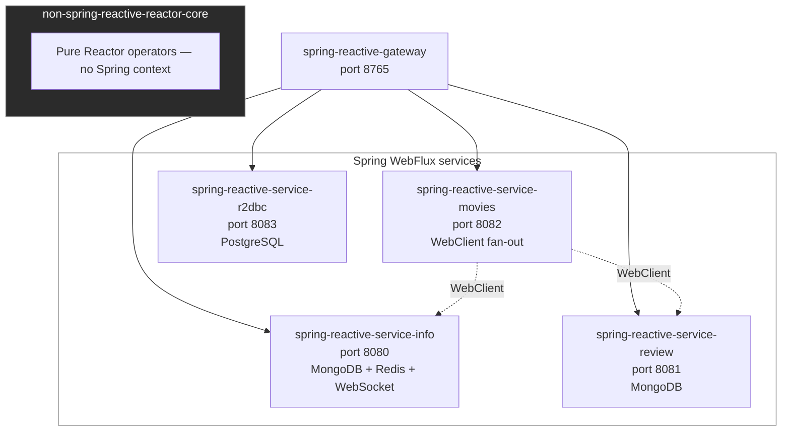
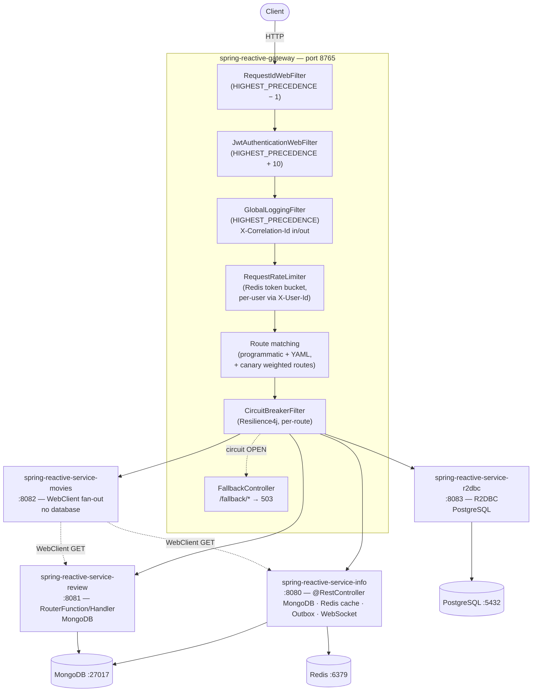
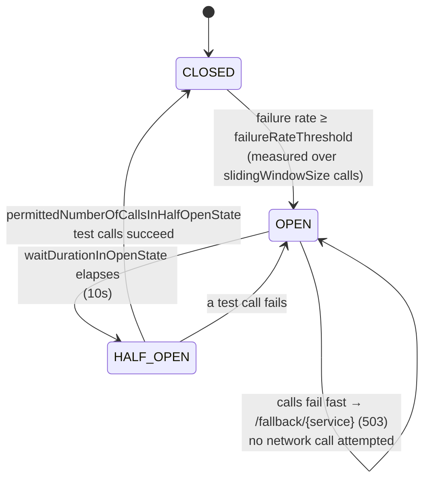
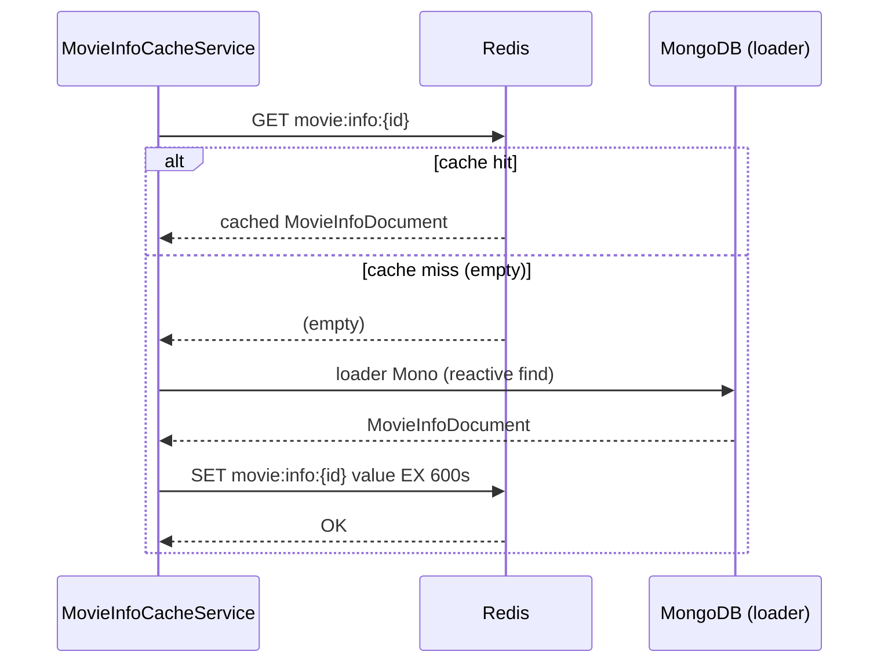
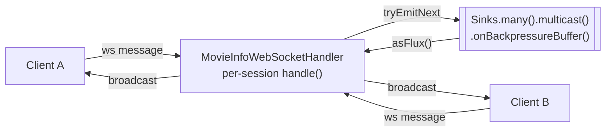

# Learning Reactive — Spring WebFlux & Project Reactor


A production-grade, multi-module learning platform that explores every dimension of reactive programming on the JVM — from raw Reactor operators, through reactive MongoDB and R2DBC/PostgreSQL persistence, Redis caching, a transactional outbox, WebSocket and SSE streaming, all the way to a Spring Cloud Gateway with JWT auth, Redis-backed rate limiting, canary routing, circuit breakers, and Testcontainers-backed integration tests.

---

## Table of Contents

1. 🔹 [What This Project Is](#1-what-this-project-is)
2. 🧵 [Why Reactive Programming Exists](#2-why-reactive-programming-exists)
3. 📨 [The Reactive Streams Specification](#3-the-reactive-streams-specification)
4. 🧵 [Project Reactor — Mono and Flux](#4-project-reactor--mono-and-flux)
5. 🏗️ [System Architecture](#5-system-architecture)
6. 🏗️ [Module Breakdown](#6-module-breakdown)
7. 🧰 [Technology Stack](#7-technology-stack)
8. 🏗️ [Design Patterns in Use](#8-design-patterns-in-use)
9. 🧵 [Spring WebFlux Deep Dive](#9-spring-webflux-deep-dive)
10. 🔹 [Server-Sent Events and Sinks](#10-server-sent-events-and-sinks)
11. 🧵 [WebClient — Reactive HTTP](#11-webclient--reactive-http)
12. ☁️ [Spring Cloud Gateway](#12-spring-cloud-gateway)
13. 🛡️ [Resilience Patterns](#13-resilience-patterns)
14. 🗄️ [Reactive Persistence — MongoDB and R2DBC/PostgreSQL](#14-reactive-persistence--mongodb-and-r2dbcpostgresql)
15. ⚡ [Reactive Caching with Redis](#15-reactive-caching-with-redis)
16. 🧩 [Transactional Outbox Pattern](#16-transactional-outbox-pattern)
17. 🧵 [Reactive WebSocket](#17-reactive-websocket)
18. ⚠️ [Validation and Error Handling](#18-validation-and-error-handling)
19. 🧪 [Testing Strategy](#19-testing-strategy)
20. 📚 [API Reference](#20-api-reference)
21. 🚀 [Running the Project](#21-running-the-project)
22. 🧵 [Pros and Cons of Reactive Programming](#22-pros-and-cons-of-reactive-programming)
23. 🔹 [Key Learning Takeaways](#23-key-learning-takeaways)

---

## 1. What This Project Is

This repository is a deliberate, end-to-end study of reactive programming in the Spring ecosystem. It is not a toy demo — every piece is production-grade: validation, global exception handling, circuit breakers, retry with exponential backoff, SSE streaming, Testcontainers integration tests, WireMock contract tests, Prometheus metrics, and a reactive API gateway.

The project is structured as a Maven multi-module build:

```
learning-reactive/
├── non-spring-reactive-reactor-core/     # Pure Reactor — no Spring at all
├── spring-reactive-service-info/         # WebFlux @RestController, MongoDB, Redis cache, outbox, WebSocket, SSE
├── spring-reactive-service-review/       # WebFlux functional router/handler, MongoDB
├── spring-reactive-service-movies/       # WebClient fan-out aggregation service
├── spring-reactive-service-r2dbc/        # R2DBC + PostgreSQL, TransactionalOperator, bulk insert
└── spring-reactive-gateway/              # Spring Cloud Gateway — CB, JWT auth, Redis rate limiting, canary routing
```

Each module is a self-contained learning unit that builds on the previous one. Supporting infrastructure — MongoDB, Redis, and PostgreSQL — is provisioned by the root `docker-compose.yml` so the whole system can be brought up with a single command (see [§21 Running the Project](#21-running-the-project)).



---

## 2. Why Reactive Programming Exists

### The Problem with Blocking I/O

A traditional Spring MVC application handles each HTTP request on a dedicated thread from a thread pool (typically Tomcat's, default 200 threads). While a request waits for a database query or a downstream HTTP call to return, that thread sits idle — it holds memory and a kernel scheduling slot but does no work.

```
Thread 1:   ──[request]──[WAITING FOR DB 80ms]──[response]──
Thread 2:   ──[request]──[WAITING FOR HTTP 120ms]──[response]──
Thread 3:   ──[request]──[WAITING FOR DB 60ms]──[response]──
...
Thread 200: ─── QUEUED — can't start until one of above finishes ───────
```

Under high concurrency, all 200 threads are in a waiting state simultaneously. New requests queue or are rejected. The CPU is mostly idle even though the application is "busy". This is the C10k problem scaled up.

### The Non-Blocking I/O Answer

Reactive / non-blocking I/O separates the thread that initiates I/O from the thread that handles the response. A small fixed thread pool (typically 1 thread per CPU core in Netty) handles all I/O. When a database or HTTP response arrives, it is dispatched on whichever thread is free.

```
Core 1: [req A start]→[callback A registered]→[req B start]→[handle response C]→[req D start]→...
Core 2: [req E start]→[handle response A]→[req F start]→[handle response B]→...
```

The same 8 cores handle thousands of concurrent connections. Threads are never idle-waiting. Memory usage is lower because fewer threads are alive.

### When Reactive Wins

| Scenario                                               | Benefit                                                                |
|--------------------------------------------------------|------------------------------------------------------------------------|
| Many concurrent users, mostly I/O bound                | Dramatic reduction in thread count and memory                          |
| Service aggregation (fan-out to N downstream services) | Parallel non-blocking fan-out with `Mono.zip`                          |
| Real-time streaming (SSE, WebSocket)                   | Long-lived connections with zero thread per connection                 |
| High-throughput event pipelines                        | Backpressure prevents fast producer from overloading slow consumer     |
| Microservice-to-microservice calls                     | WebClient is fully non-blocking; RestTemplate blocks a thread per call |

### When Reactive Does NOT Win

- CPU-bound work (image processing, heavy computation) — threads are busy computing anyway; non-blocking offers no advantage
- Simple CRUD with low concurrency — the complexity cost exceeds the benefit
- Teams unfamiliar with functional programming — steep learning curve with debugging difficulties
- Legacy libraries that block internally — mixing blocking code into reactive pipelines causes deadlocks on the small event-loop thread pool

---

## 3. The Reactive Streams Specification

Reactive Streams (`org.reactivestreams`) is a JVM specification (not an implementation) that defines four interfaces:

```
Publisher<T>   — produces items: void subscribe(Subscriber<? super T> s)
Subscriber<T>  — consumes items: onSubscribe, onNext, onError, onComplete
Subscription   — link between Publisher and Subscriber: request(n), cancel()
Processor<T,R> — both Publisher and Subscriber (transformation stage)
```

The specification is included in Java 9+ as `java.util.concurrent.Flow.*`. The critical rule is **backpressure**: a Subscriber controls how many items it receives by calling `subscription.request(n)`. The Publisher must not emit more than `n` items until the next `request(n)` call. This prevents a fast producer from overwhelming a slow consumer.

### Why the Spec Matters

The spec defines interoperability. Project Reactor, RxJava, Akka Streams, and Vert.x all implement the same four interfaces, so their streams can interoperate. Spring WebFlux uses Reactor but can accept any `Publisher<T>`.

---

## 4. Project Reactor — Mono and Flux

Project Reactor is Pivotal's (now VMware/Broadcom's) implementation of Reactive Streams. It is the reactive library that Spring WebFlux is built on.

### Mono\<T\>

`Mono<T>` is a Publisher that emits **0 or 1 items** then completes (or errors). Use it for:
- A single database lookup by ID
- A single HTTP GET that returns one object
- Any async operation that has at most one result

```java
Mono<String> greeting = Mono.just("Hello World");
Mono<MovieInfo> info   = repository.findById("abc123"); // 0 or 1 result
Mono<Void>     deleted = repository.deleteById("abc123");
```

### Flux\<T\>

`Flux<T>` is a Publisher that emits **0 to N items** then completes (or errors). Use it for:
- Returning a list of database documents
- Streaming events (SSE)
- Processing a collection item by item in a pipeline

```java
Flux<String> names    = Flux.just("Alice", "Bob", "Carol");
Flux<Movie>  allMovies = repository.findAll();            // N results
Flux<Long>   ticker    = Flux.interval(Duration.ofSeconds(1)); // infinite
```

### Cold vs Hot Publishers

**Cold** — each subscriber gets its own independent data stream starting from the beginning. A database query is cold: every subscriber triggers a fresh query.

**Hot** — all subscribers share one live stream. Items emitted before subscription are missed (or replayed, depending on the hot source type). `Sinks` in this project produce hot publishers.

```java
// Cold — each subscriber re-runs the DB query
Flux<MovieInfo> cold = repository.findAll();

// Hot — all subscribers share one live event stream
Sinks.Many<MovieInfo> sink = Sinks.many().replay().all();
Flux<MovieInfo> hot  = sink.asFlux(); // new subscriber gets all past + future events
```

### Operator Catalogue — What This Project Uses

#### Transformation

| Operator    | What it does                                                           | Used where                                            |
|-------------|------------------------------------------------------------------------|-------------------------------------------------------|
| `map`       | 1-to-1 synchronous transform of each item                              | `FluxFlow` — uppercase, length prefix                 |
| `flatMap`   | 1-to-many async transform, subscribes to inner publishers concurrently | `MoviesController` — for each movieInfo fetch reviews |
| `concatMap` | Like `flatMap` but preserves order (subscribes serially)               | `FluxFlow` — demonstrates ordering                    |
| `transform` | Applies a reusable `Function<Flux<T>, Flux<R>>` to the pipeline        | `FluxFlow` — extract shared map+filter logic          |

#### Filtering

| Operator         | What it does                                                  |
|------------------|---------------------------------------------------------------|
| `filter`         | Drop items not matching predicate                             |
| `defaultIfEmpty` | Emit a static value if upstream completes empty               |
| `switchIfEmpty`  | Subscribe to a fallback Publisher if upstream completes empty |

#### Combination (demonstrated in `CombineMonoFlux`)

| Operator                     | Behaviour                                                 | Order preserved? |
|------------------------------|-----------------------------------------------------------|------------------|
| `Flux.concat` / `concatWith` | Subscribe to second only after first completes            | Yes              |
| `Flux.merge` / `mergeWith`   | Subscribe to both immediately, interleave by arrival time | No               |
| `Flux.mergeSequential`       | Subscribe to both immediately, emit in subscription order | Yes              |
| `Flux.zip` / `zipWith`       | Pair items from N publishers by index                     | Yes              |

#### Error Handling

| Operator        | Behaviour                                                   |
|-----------------|-------------------------------------------------------------|
| `onErrorReturn` | Emit a static fallback value on error, then complete        |
| `onErrorResume` | Switch to a fallback Publisher on error                     |
| `onErrorMap`    | Transform one error type to another                         |
| `retryWhen`     | Resubscribe to upstream on error, with configurable backoff |
| `doOnError`     | Side-effect on error (logging) — does not change the error  |

#### Lifecycle Hooks

```java
// Used throughout the codebase for logging and side-effects
.doOnSubscribe(sub -> log.info("Subscribed"))
.doOnNext(item   -> log.debug("Item: {}", item))
.doOnError(ex    -> log.error("Error", ex))
.doOnComplete(   () -> log.info("Stream complete"))
.doOnSuccess(v   -> log.info("Mono emitted: {}", v))
```

### The Subscription Contract

Nothing happens until someone subscribes. This is the single most important mental model shift from imperative programming.

```java
Flux<MovieInfo> pipeline = repository.findAll()
    .filter(m -> m.year() > 2000)
    .map(m -> m.name().toUpperCase());

// pipeline is a DESCRIPTION of work. No DB query has run yet.

pipeline.subscribe(); // NOW the query runs
```

In Spring WebFlux, the framework subscribes on your behalf when you return a `Mono<T>` or `Flux<T>` from a controller method. You almost never call `.subscribe()` directly in application code.

---

## 5. System Architecture

### Runtime Topology

Every external request enters through `spring-reactive-gateway` on port 8765. The gateway is the only component that should be addressed directly by a client; it fans requests out to whichever backend service owns that URL space, and it owns cross-cutting concerns — correlation IDs, JWT validation, rate limiting, circuit breaking — so individual services can stay focused on their own domain logic.



**Filter ordering on the gateway matters.** `RequestIdWebFilter` runs first so every downstream filter and log line can reference a stable request id. `JwtAuthenticationWebFilter` runs next (skipping `/actuator/**`, `/fallback/**`, `/v1/public/**`) and, on success, injects `X-User-Id` — which `RateLimiterConfig`'s `userKeyResolver` then uses to bucket rate limits per authenticated user rather than per IP. `GlobalLoggingFilter` wraps the remaining chain to log the full request/response cycle with timing.

### Request Flow Through the Gateway

The sequence diagram below traces one representative reactive request end to end — `GET /v1/movies/{id}` — from the client, through the gateway's filter chain, into the movies aggregation service, out to two downstream WebClient calls, and back. Every arrow is non-blocking: no participant thread ever sits idle waiting on another.

```mermaid
sequenceDiagram
    autonumber
    participant C as Client
    participant GW as Gateway<br/>(Netty event loop)
    participant MV as service-movies<br/>(MoviesController)
    participant INFO as service-info<br/>(MongoDB reactive)
    participant REV as service-review<br/>(MongoDB reactive)

    C->>GW: GET /v1/movies/abc123
    Note over GW: RequestIdWebFilter stamps X-Request-Id
    Note over GW: JwtAuthenticationWebFilter validates Bearer token
    Note over GW: GlobalLoggingFilter stamps X-Correlation-Id, logs →
    GW->>GW: Route match "movies-service" (/v1/movies/**)<br/>CircuitBreaker state = CLOSED
    GW->>MV: forward GET /v1/movies/abc123
    par non-blocking fan-out
        MV->>INFO: WebClient GET /v1/movieInfo/abc123
        INFO->>INFO: reactive Mongo find (non-blocking driver)
        INFO-->>MV: 200 MovieInfo JSON
    and
        MV->>REV: WebClient GET /v1/reviews?movieInfoId=abc123
        REV->>REV: reactive Mongo find (non-blocking driver)
        REV-->>MV: 200 Review[] JSON
    end
    MV->>MV: flatMap: combine MovieInfo + List&lt;Review&gt; → Movie
    MV-->>GW: 200 Movie JSON
    Note over GW: GlobalLoggingFilter logs ← 200, adds X-Correlation-Id
    GW-->>C: 200 Movie JSON
```

Note that the two downstream calls in `MoviesController` are shown here as concurrent (`par`) — this is what a `Mono.zip`-based rewrite would achieve. The actual shipped implementation issues the review call inside a `flatMap` after the movie-info call resolves (sequential fan-out); see [Module 4](#module-4-spring-reactive-service-movies) for the exact code and the parallel alternative.

---

## 6. Module Breakdown

### Module 1: `non-spring-reactive-reactor-core`

**Purpose:** Learn raw Reactor operators with zero Spring context. All tests run synchronously using `StepVerifier` — no application server, no DI, no database.

**Key classes:**

- `FluxFlow` — 9 operators: `map`, `filter`, `flatMap`, `concatMap`, `transform`, `defaultIfEmpty`, `switchIfEmpty`, with and without `delayElements`
- `MonoFlow` — `map`, `flatMap`, `flatMapMany`, `defaultIfEmpty`, `switchIfEmpty`
- `CombineMonoFlux` — stream combination: `concat`, `concatWith`, `merge`, `mergeWith`, `mergeSequential`, `zip`, `zipWith` on both Mono and Flux

**Critical lesson:** `flatMap` with `delayElements` produces interleaved (non-ordered) output because it subscribes to all inner publishers concurrently. `concatMap` preserves order because it subscribes to inner publishers one at a time.

```
flatMap(name → split chars + random delay):
  "Himansu" + "Nayak" → H N A I Y M A A N K S U  (order depends on timing)

concatMap(name → split chars + random delay):
  "Himansu" + "Nayak" → H I M A N S U N A Y A K  (Himansu always first)
```

---

### Module 2: `spring-reactive-service-info`

**Purpose:** A full CRUD reactive REST service with MongoDB persistence, field-level validation, global exception handling, and SSE streaming.

**Architecture style:** Annotation-based `@RestController` implementing a `@RequestMapping` interface (`MovieInfoApi`). The interface owns all annotations; the controller is a pure implementation class.

**Domain:** `MovieInfoDocument` — a Java record annotated with `@Document` (MongoDB) and Bean Validation constraints:
```java
@Document
public record MovieInfoDocument(
    @Id String movieInfoId,
    @NotBlank String name,
    @NotNull @Positive Integer year,
    @NotNull List<@NotBlank String> cast,
    LocalDate releaseDate
) {}
```

**Port:** 8080

**Filtering:** `GET /v1/movieInfos?year=2023` and `GET /v1/movieInfos?name=Batman` are implemented by reading `@RequestParam Map<String, String> filterCriteria`. The key type must be `String` — Spring cannot auto-convert string query-param keys to enum types, so `Map<EnumType, String>` always arrives empty.

**SSE Stream:** `GET /v1/movieInfo/stream` returns real `text/event-stream` frames (`ServerSentEvent<MovieInfoDocument>` with `id`/`event`/`data`), not raw JSON. A `Sinks.Many<MovieInfoDocument>` configured as `replay().all()` means new SSE subscribers receive ALL past events (full replay) then live events. See [§10](#10-server-sent-events-and-sinks) for the wire-format detail and how it differs from the review service's NDJSON stream.

**Additional endpoints not shown above:** `POST /v1/movieInfo/batch` accepts a streaming `Flux<MovieInfoDocument>` request body for memory-efficient bulk inserts; `GET /v1/movieInfo/tailable` streams newly-inserted documents in real time via a MongoDB **tailable cursor** against a capped collection (`@Tailable` on `MovieInfoRepository.findWithTailableCursorBy()`) — a different real-time mechanism from the `Sinks`-based SSE stream, driven by the database itself rather than an in-process sink; `GET /v1/movieInfo/summary` and `GET /v1/movieInfo/{id}/summary` return the `MovieSummary` projection described above; and `GET /v1/flux`, `/v1/mono`, `/v1/stream` are minimal `Flux`/`Mono`/infinite-`Flux.interval` demo endpoints kept from the original "hello reactive world" exercise.

**Caveat:** `MovieInfoCacheService` (the Redis cache-aside component described in [§15](#15-reactive-caching-with-redis)) is a standalone `@Service` — nothing in `MovieInfoController` or `MovieInfoServiceImpl` currently calls it, so reads always go straight to MongoDB. It demonstrates the cache-aside pattern in isolation, ready to be wired into `getMovieById`/`getAllMovies` as a follow-up exercise, but as shipped it is not yet on the live read path.

The info service is the most feature-dense module in the repo — beyond basic CRUD it also demonstrates four additional reactive patterns, each covered in depth in its own section later in this document:

- **Reactive caching (cache-aside) with Redis** — `cache/MovieInfoCacheService` wraps a `ReactiveRedisTemplate<String, MovieInfoDocument>` and implements a non-blocking cache-aside pattern (`get` → on miss, `loader` → `set` with a 10-minute TTL). See [§15](#15-reactive-caching-with-redis).
- **Transactional Outbox pattern** — `outbox/OutboxService`, `OutboxEvent`, and `OutboxRepository` persist domain events as `PENDING` and relay them on a `@Scheduled` fixed-delay loop, avoiding the dual-write problem between the database and a message broker. See [§16](#16-transactional-outbox-pattern).
- **Reactive WebSocket** — `websocket/MovieInfoWebSocketHandler` implements `WebSocketHandler` directly (not SSE) using a multicast `Sinks.Many<String>` to broadcast every inbound client message to all connected sessions. See [§17](#17-reactive-websocket).
- **MongoDB field projections** — `projection/MovieInfoProjectionRepository` uses `@Query(fields = ...)` to return a slim `MovieSummary` record instead of the full `MovieInfoDocument`, a lightweight CQRS-style read model for list views.
- **Reactor Context → MDC bridging** — `util/ReactiveLogger` shows the correct (and only safe) way to get correlation data into SLF4J's `MDC` from a reactive pipeline: read it out of `Mono.deferContextual`, `MDC.put` synchronously, log, then `MDC.remove` in the same synchronous block — never leaving it set across a thread hop.

---

### Module 3: `spring-reactive-service-review`

**Purpose:** A reactive review service demonstrating the **functional router/handler** style of WebFlux routing, as an explicit contrast to the annotation-based style in the info service.

**Architecture style:** Functional — `RouterFunction<ServerResponse>` (defines routes) + `ReviewHandler` (handles requests). There are no `@Controller` or `@RequestMapping` annotations anywhere on handler methods.

```java
// Router — only defines the URL structure and HTTP verbs
@Bean
public RouterFunction<ServerResponse> reviewRouterFunction() {
    return route()
        .nest(path("/v1/reviews"), builder -> builder
            .POST("",         reviewHandler::addReview)
            .GET("",          reviewHandler::getReviews)
            .PUT("/{reviewId}", reviewHandler::upsertReview)
            .DELETE("/{reviewId}", reviewHandler::deleteReview)
            .GET("/stream",   reviewHandler::getReviewsStream))
        .build();
}

// Handler — reads request, writes response — pure application logic
public Mono<ServerResponse> addReview(ServerRequest request) {
    return request.bodyToMono(ReviewDocument.class)
        .doOnNext(reviewValidator::validate)
        .flatMap(reviewRepository::save)
        .doOnNext(reviewInfoSinks::tryEmitNext)
        .flatMap(ServerResponse.status(HttpStatus.CREATED)::bodyValue);
}
```

**Port:** 8081

**SSE:** `Sinks.many().replay().latest()` — new subscribers only get the most recent event, not the full history.

**Validation:** Manual `ReviewValidator` instead of `@Valid`, because `ServerRequest.bodyToMono` does not trigger Bean Validation automatically in functional routing. The validator throws `ReviewDataException` which the `GlobalExceptionHandler` converts to 400.

---

### Module 4: `spring-reactive-service-movies`

**Purpose:** A pure aggregation service with NO database. Its only job is to make two non-blocking HTTP calls to the info and review services and combine their results into a single `Movie` response.

**Pattern:** Reactive fan-out using `flatMap`:
```java
movieInfoClient.retrieveMovieInfo(movieId)   // Mono<MovieInfo>
    .flatMap(movieInfo ->
        reviewClient.retrieveReviews(movieId)   // Flux<Review>
            .collectList()                       // Mono<List<Review>>
            .map(reviews -> new Movie(movieInfo, reviews))
    )
```

Note: This is sequential fan-out (reviews fetched after movie info arrives). A true parallel fan-out where both calls start simultaneously uses `Mono.zip`:
```java
// Parallel alternative — both HTTP calls fire at the same time
Mono.zip(
    movieInfoClient.retrieveMovieInfo(movieId),
    reviewClient.retrieveReviews(movieId).collectList()
).map(tuple -> new Movie(tuple.getT1(), tuple.getT2()))
```

**Port:** 8082

**Error handling in WebClient:**
- `onStatus(4xx)` → typed `MoviesInfoClientException` / `ReviewsClientException`
- `onStatus(5xx)` → `MoviesInfoServerException` / `ReviewsServerException`
- `retryWhen(Retry.backoff(3, 1s).filter(MoviesInfoServerException))` — retry only server errors with exponential backoff (1s, 2s, 4s); give up after 3 attempts

---

### Module 5: `spring-reactive-service-r2dbc`

**Purpose:** A CRUD service for a `Genre` entity backed by **PostgreSQL via R2DBC** — the reactive counterpart to the MongoDB modules. It exists specifically to contrast a reactive *relational* database driver against the reactive *document* drivers used elsewhere in the project, including how reactive transactions work when there is no shared-connection-per-thread assumption to lean on.

**Domain:** `Genre` — a Java record mapped with `@Table`/`@Id` (Spring Data R2DBC, not JPA):
```java
@Table("genres")
public record Genre(
    @Id Long id,
    @NotBlank(message = "Genre.name cannot be blank") String name,
    String description,
    @CreatedDate LocalDateTime createdAt
) {
    public static Genre of(String name, String description) {
        return new Genre(null, name, description, null);
    }
}
```

**Port:** 8083

**Repository:** `GenreRepository extends ReactiveCrudRepository<Genre, Long>` adds a derived query (`findByNameContainingIgnoreCase`) and a custom `@Query`-annotated SQL method:
```java
@Query("SELECT * FROM genres WHERE created_at > NOW() - INTERVAL '1 day' ORDER BY created_at DESC")
Flux<Genre> findRecentGenres();
```
Unlike JPA/JDBC, R2DBC's `@Query` executes over the reactive PostgreSQL wire protocol (`r2dbc-postgresql`) — the query never blocks a thread waiting for the result set.

**Reactive transactions:** `GenreService` is constructed with a `TransactionalOperator` and wraps writes explicitly, e.g. `txOperator.transactional(repository.save(genre))`. This is the reactive equivalent of `@Transactional` — imperative `@Transactional` relies on a `ThreadLocal`-bound connection, which does not exist in a reactive pipeline where execution hops schedulers. `TransactionalOperator.transactional(...)` instead threads the transaction context through the Reactor `Context`, and rolls back automatically if the wrapped `Mono`/`Flux` emits an error.

**Bulk insert:** `createBatch(List<Genre>)` calls `repository.saveAll(Flux.fromIterable(genres))` inside the same `TransactionalOperator` — the whole batch commits or rolls back as one unit, and because the input is a `Flux` rather than a materialized list internally, it composes naturally with a streaming request body if the controller were changed to accept NDJSON.

**Auditing:** `@EnableR2dbcAuditing` (in `R2dbcConfig`) automatically populates the `@CreatedDate` field on insert — no manual timestamping in service code.

**Endpoints:** `GET /v1/genres`, `GET /v1/genres/{id}`, `GET /v1/genres/search?name=`, `POST /v1/genres`, `POST /v1/genres/batch`, `PUT /v1/genres/{id}`, `DELETE /v1/genres/{id}`.

---

### Module 6: `spring-reactive-gateway`

**Purpose:** The single entry point for all external traffic. Routes all calls to the correct backend service, enforces circuit breakers, validates JWTs, rate-limits per user via Redis, adds correlation and request IDs, applies request/response enrichment filters, supports canary/weighted routing, and exposes a Gateway-aware Actuator endpoint.

**Port:** 8765

All client applications should target `http://localhost:8765` instead of individual service ports.

**Filter chain (in execution order):**

| Order | Filter | Responsibility |
|---|---|---|
| `HIGHEST_PRECEDENCE − 1` | `RequestIdWebFilter` | Honours an inbound `X-Request-Id` or mints a UUID; writes it into Reactor `Context` for downstream operators, not just the header |
| `HIGHEST_PRECEDENCE` | `GlobalLoggingFilter` | Generates/propagates `X-Correlation-Id`; logs `→`/`←` request and response lines with timing |
| `HIGHEST_PRECEDENCE + 10` | `JwtAuthenticationWebFilter` | Validates the `Bearer` JWT (via `jjwt`) on every path except `/actuator/**`, `/fallback/**`, `/v1/public/**`; injects `X-User-Id` from the token's subject claim so downstream services trust the caller identity without re-validating the token themselves |
| route-level | `RequestRateLimiter` (default-filter, all routes) | Redis-backed token bucket (`replenishRate: 10`, `burstCapacity: 20`) keyed by `userKeyResolver` — prefers `X-User-Id` (set by the JWT filter) and falls back to the caller's remote IP for public/unauthenticated routes |
| route-level | `PreFilter` / `PostFilter` (named `GatewayFilterFactory`) | Stamp `X-Gateway-Version` and compute `X-Response-Time-Ms` on selected YAML routes |
| route-level | `circuitBreaker` (Resilience4j) | Per-route circuit breaking with a `forward:/fallback/{service}` fallback URI |

**JWT validation (`JwtAuthenticationWebFilter` + `TokenUtil`):** rejects requests with a missing/malformed `Authorization` header or an invalid/expired token with `401 Unauthorized` *before* the request reaches route matching — auth failures never count against a circuit breaker or reach a backend service.

**Rate limiting (`RateLimiterConfig`):** the `userKeyResolver` bean resolves the rate-limit bucket key reactively:
```java
@Bean
public KeyResolver userKeyResolver() {
    return exchange -> Mono.justOrEmpty(
            exchange.getRequest().getHeaders().getFirst("X-User-Id"))
            .switchIfEmpty(Mono.just(
                    exchange.getRequest().getRemoteAddress().getAddress().getHostAddress()));
}
```
Because JWT validation runs before rate limiting in the filter chain, authenticated callers get a stable per-user bucket instead of sharing a bucket by IP (which would unfairly throttle everyone behind the same NAT/proxy).

**Canary / weighted routing:** `application.yml` defines two routes sharing a `Weight` group — 80% of `/v1/movieInfo/**` traffic stays on the stable route (port 8080) and 20% is routed to a canary v2 instance (port 8083) with an `X-Canary: true` header added, letting a new version absorb a fraction of production traffic without a separate gateway deployment.

---

## 7. Technology Stack

| Technology | Version | Role |
|---|---|---|
| Java | 25 | Runtime — records, sealed types, pattern matching |
| Spring Boot | 4.1.0 | Auto-configuration, embedded Netty, Actuator (pinned in root `pom.xml`, overriding the corporate `super-pom` parent) |
| Spring Framework / WebFlux | 7.0.8 (via Boot 4.1.0) | Reactive web framework on Project Reactor |
| Project Reactor | 3.8.6 (via Boot) | Mono, Flux, Sinks, Schedulers |
| Spring Cloud | 2025.1.2 | BOM for `spring-cloud-starter-gateway-server-webflux` and `spring-cloud-starter-circuitbreaker-reactor-resilience4j` |
| Spring Data Reactive MongoDB | via Boot | Non-blocking MongoDB driver (info + review services) |
| Spring Data R2DBC | via Boot | Non-blocking relational driver (r2dbc service) |
| `r2dbc-postgresql` | 1.0.7.RELEASE | Reactive PostgreSQL wire-protocol driver |
| MongoDB | 7 (Docker / Testcontainers) | Document database for info and review services |
| PostgreSQL | 16 (Docker / Testcontainers) | Relational database for the r2dbc service |
| Redis | 7 (Docker) | Reactive cache-aside store (info service) + Gateway `RequestRateLimiter` token bucket |
| `jjwt` (api/impl/jackson) | 0.12.6 | JWT issuing/validation for the gateway's `JwtAuthenticationWebFilter` |
| Resilience4j | via Boot | Circuit breaker, time limiter, bulkhead (gateway) |
| Micrometer + Prometheus | via Boot | Metrics collection and scraping |
| WireMock | via spring-cloud-contract | HTTP stub server for movies service integration tests |
| Testcontainers | 1.20.4 | Real MongoDB / PostgreSQL in integration tests via Docker |
| AssertJ | via Boot | Fluent assertions in tests |
| StepVerifier | via reactor-test | Reactive stream assertion DSL |
| Maven | 3.9.x | Multi-module build |

---

## 8. Design Patterns in Use

### Publisher–Subscriber

The foundational pattern. Every Reactor pipeline is a publisher chain. The framework (Spring WebFlux) is the subscriber. Application code only assembles the pipeline — it never explicitly subscribes.

### Interface Segregation for Controllers

The info service defines a `MovieInfoApi` interface with all `@RequestMapping` annotations. The `MovieInfoController` implements it with zero Spring annotations of its own. This separates the HTTP contract (interface) from the implementation, making it possible to unit-test the controller logic with a mock `MovieInfoService` without any web context.

```java
// Contract
public interface MovieInfoApi {
    @GetMapping("/v1/movieInfos")
    Flux<MovieInfoDocument> getAllMovieInfos(@RequestParam Map<String, String> filterCriteria);
}

// Implementation — no Spring web annotations needed here
@RestController
public class MovieInfoController implements MovieInfoApi {
    public Flux<MovieInfoDocument> getAllMovieInfos(Map<String, String> filterCriteria) {
        // ... service delegation ...
    }
}
```

### Functional Router/Handler (Command Pattern Variant)

The review service uses WebFlux's functional routing DSL. The `RouterFunction` is a pure function `(ServerRequest) → Optional<HandlerFunction>`. The `ReviewHandler` contains all business logic. This style is more composable and testable than annotation scanning — you can unit-test the handler by passing a `MockServerRequest` directly.

### Sinks — Reactive Event Bus

`Sinks.Many<T>` acts as a programmatic event bus. Application code calls `sink.tryEmitNext(item)` from anywhere (typically in a `.doOnNext` side-effect); the sink's `asFlux()` provides the hot publisher that SSE connections subscribe to.

```
POST /v1/movieInfo
  → controller saves to MongoDB
  → doOnNext: movieInfoSinks.tryEmitNext(saved)       ← event published
                    │
                    ▼
  All active GET /v1/movieInfo/stream subscribers receive the new document
```

### Circuit Breaker (Stability Pattern)

Wraps outbound calls from the gateway to backend services. When a backend fails repeatedly, the circuit opens and requests fail fast with a 503 fallback instead of waiting for timeout. The circuit transitions: `CLOSED → OPEN → HALF_OPEN → CLOSED` automatically.

```
CLOSED    — all requests forwarded; failures counted toward threshold
OPEN      — all requests short-circuit to fallback; no downstream calls made
HALF_OPEN — limited test calls forwarded to check if backend recovered
```

### Retry with Exponential Backoff

The movies service retries failed calls to the info service up to 3 times with exponential backoff (1s, 2s, 4s). Retries only trigger on server errors — not client errors, because retrying a 400 Bad Request will always return 400.

```java
.retryWhen(Retry.backoff(3, Duration.ofSeconds(1))
    .filter(ex -> ex instanceof MoviesInfoServerException)
    .onRetryExhaustedThrow((spec, signal) -> signal.failure()))
```

### Filter Chain (Chain of Responsibility)

The gateway applies filters in strict order. Each filter calls `chain.filter(exchange)` to pass control to the next. Filters can act before (pre) or after (post) the downstream call using `.then()` or `doOnSuccess`.

```
Request:  GlobalLoggingFilter → CircuitBreakerFilter → PreFilter → DOWNSTREAM
Response:                  GlobalLoggingFilter.doOnSuccess ← PostFilter ← DOWNSTREAM
```

### Hybrid Route Definition

Routes are split across two mechanisms:
- **Programmatic** (`GatewayRoutesConfig.java`) for routes requiring type-safe filter config (circuit breakers, typed retry)
- **Declarative YAML** (`application.yml`) for simpler SSE stream routes where named `GatewayFilterFactory` beans are sufficient

Both sets of routes are merged by Spring Cloud Gateway at startup.

---

## 9. Spring WebFlux Deep Dive

### The Two Programming Models

WebFlux offers two distinct ways to write HTTP endpoints:

#### Annotation-based (info service)

Identical surface-level API to Spring MVC: `@RestController`, `@GetMapping`, `@RequestBody`, `@PathVariable`. The difference is that return types are `Mono<T>` or `Flux<T>` instead of `T` or `List<T>`.

```java
@GetMapping("/v1/movieInfo/{id}")
public Mono<ResponseEntity<MovieInfoDocument>> getMovieInfo(@PathVariable String id) {
    return movieInfoService.getMovieById(id)
        .map(doc -> ResponseEntity.ok().body(doc))
        .switchIfEmpty(Mono.just(ResponseEntity.notFound().build()));
}
```

Spring WebFlux subscribes to the returned `Mono` and sends the response when it completes. The thread that received the HTTP request is released immediately — it does not wait for the DB response.

#### Functional (review service)

Routes and handlers are Spring beans, not scanned classes. Routes are composed programmatically. This style is preferred when you need complex route composition, conditional routing, or want to test the routing logic in isolation.

```java
// Router — pure routing logic, no business code
route()
    .nest(path("/v1/reviews"), b -> b
        .POST("",      handler::addReview)
        .GET("/{id}",  handler::getReviews)
        .DELETE("/{id}", handler::deleteReview))
    .build();

// Handler — reads request, returns Mono<ServerResponse>
public Mono<ServerResponse> addReview(ServerRequest req) {
    return req.bodyToMono(ReviewDocument.class)
        .flatMap(repository::save)
        .flatMap(ServerResponse.status(CREATED)::bodyValue);
}
```

### The Event Loop — How Netty Handles Concurrency

WebFlux runs on Netty, an NIO event-loop server. Netty creates one thread per CPU core (the "event loop group"). All I/O happens on these threads asynchronously.

When an HTTP request arrives:
1. A Netty event-loop thread reads the bytes and builds the `ServerHttpRequest`
2. WebFlux assembles your Reactor pipeline (no I/O yet — this is just pipeline construction)
3. The pipeline's I/O operations (DB reads, WebClient calls) register callbacks with the OS (epoll/kqueue)
4. The event-loop thread is freed immediately to handle the next request
5. When the OS signals data is ready, a callback fires on whichever event-loop thread is free
6. The response bytes are written and the connection completes

**Critical rule:** Never block on an event-loop thread. Calling `Thread.sleep()`, a blocking JDBC query, or `Mono.block()` inside a reactive pipeline starves all other requests sharing that thread.

### Schedulers — Switching Thread Contexts

When you must do blocking work inside a reactive pipeline (e.g., calling a legacy blocking library), you explicitly switch to a separate thread pool:

```java
Mono.fromCallable(() -> legacyBlockingService.call())
    .subscribeOn(Schedulers.boundedElastic()) // runs on dedicated blocking thread pool
    .flatMap(result -> reactiveRepository.save(result)); // back on event loop
```

`Schedulers.boundedElastic()` is a thread pool designed for blocking I/O — it grows to handle demand and shrinks when idle, but its threads are separate from the Netty event loops.

---

## 10. Server-Sent Events and Sinks

### What is SSE?

Server-Sent Events (SSE) is an HTTP/1.1 protocol where the server sends a stream of `text/event-stream` or `application/x-ndjson` messages over a single persistent HTTP connection. The client receives each event as it arrives. Unlike WebSocket, SSE is unidirectional (server → client only) and uses plain HTTP — no upgrade handshake needed.

### How This Project Implements SSE

Both the info and review services use `Sinks.Many<T>` as the SSE event source. Each service has one in-memory sink; SSE subscribers receive events from that sink.

**Info service** — `replay().all()`, real SSE framing via `ServerSentEvent<T>`:
```java
private final Sinks.Many<MovieInfoDocument> movieInfoSinks = Sinks.many().replay().all();

// On every successful create:
movieInfoSinks.tryEmitNext(saved);

// SSE endpoint — new subscriber gets ALL past events then live events,
// wrapped as proper text/event-stream frames (id / event / data), not raw JSON:
@GetMapping(value = "/movieInfo/stream", produces = MediaType.TEXT_EVENT_STREAM_VALUE)
public Flux<ServerSentEvent<MovieInfoDocument>> getMovieInfoStream() {
    return movieInfoSinks.asFlux()
        .map(doc -> ServerSentEvent.<MovieInfoDocument>builder()
            .id(doc.movieInfoId())
            .event("movie-info")
            .data(doc)
            .build());
}
```
Unlike the review service below, the info service emits genuine `text/event-stream` output — each frame carries an `id:`, `event:`, and `data:` line per the SSE wire format — rather than newline-delimited JSON. A browser `EventSource` can consume `getMovieInfoStream()` directly and dispatch on the `movie-info` event name; `curl -N` still works too, since SSE is just chunked plain-text HTTP under the hood.

**Review service** — `replay().latest()`:
```java
private final Sinks.Many<ReviewDocument> reviewInfoSinks = Sinks.many().replay().latest();

// SSE endpoint returns application/x-ndjson:
public Mono<ServerResponse> getReviewsStream(ServerRequest request) {
    return ServerResponse.ok()
        .contentType(MediaType.APPLICATION_NDJSON)
        .body(reviewInfoSinks.asFlux(), ReviewDocument.class);
}
```

### Sink Strategies Compared

| Strategy | New subscriber receives | Use case |
|---|---|---|
| `replay().all()` | All past events + live | Audit log, event sourcing, full history needed |
| `replay().latest()` | Most recent event + live | Live dashboard, current state |
| `replay().limit(n)` | Last N events + live | Sliding window display |
| `multicast().onBackpressureBuffer()` | Only live events | Real-time notifications |
| `unicast()` | Only live, single subscriber | Internal pipeline handoff |

### Why SSE Routes Have No Circuit Breaker

SSE routes (`/v1/movieInfoStream`, `/v1/reviewsStream`) are in YAML without circuit breakers deliberately. A circuit breaker on a streaming connection would be wrong: once a long-lived SSE connection is established, interrupting it mid-stream would break the client's event processing state. Circuit breakers are designed for short request-response cycles, not persistent streams.

**In practice**, the YAML predicates for these two routes (`/v1/movieInfoStream`, `/v1/reviewsStream`) don't match the real endpoint paths (`/v1/movieInfo/stream`, `/v1/reviews/stream` — note the slash before "stream"). See the routing note in [§20](#20-api-reference) — as shipped, real SSE traffic actually falls through to the CB-guarded programmatic route, which is the opposite of the intent described above. Documented here as-is because [§20](#20-api-reference) is the API reference, and this section explains *why* the code is written the way it is, not that the wiring currently achieves it end-to-end.

---

## 11. WebClient — Reactive HTTP

`WebClient` is the reactive replacement for `RestTemplate`. Every method in the fluent API returns a `Mono` or `Flux` — the HTTP call does not start until subscription.

### Building a Request

```java
webClient
    .get()
    .uri(movieInfoUrl + "/{id}", movieId)         // URI template
    .retrieve()                                    // switch to response handling
    .onStatus(HttpStatusCode::is4xxClientError, response -> {
        if (response.statusCode().equals(HttpStatus.NOT_FOUND)) {
            return Mono.error(new MoviesInfoClientException("Not found: " + movieId, 404));
        }
        return response.bodyToMono(String.class)
            .flatMap(body -> Mono.error(new MoviesInfoClientException(body, response.statusCode().value())));
    })
    .onStatus(HttpStatusCode::is5xxServerError, response ->
        response.bodyToMono(String.class)
            .flatMap(body -> Mono.error(new MoviesInfoServerException("Server error: " + body)))
    )
    .bodyToMono(MovieInfo.class)
    .retryWhen(Retry.backoff(3, Duration.ofSeconds(1))
        .filter(ex -> ex instanceof MoviesInfoServerException))
    .log();
```

### Why `onStatus` Instead of Catching Exceptions Downstream

`retrieve()` throws `WebClientResponseException` for 4xx/5xx by default. `onStatus` intercepts specific status ranges before the body is deserialized and maps them to domain-specific typed exceptions. Downstream code can then `filter` retries by exception type and provide specific error messages to callers.

### Retry Logic

```
Call 1 fails (5xx) → wait 1s → Call 2 fails → wait 2s → Call 3 fails → wait 4s → Call 4 fails → throw
```

Only `MoviesInfoServerException` (5xx) triggers retry. `MoviesInfoClientException` (4xx) does not retry because the client sent a bad request — retrying won't help.

### Gateway-Level HTTP Client Configuration

The gateway's Netty HTTP client is configured in `application.yml`:

```yaml
spring:
  cloud:
    gateway:
      httpclient:
        wiretap: true          # logs every byte at Netty wire level
        connect-timeout: 1000  # ms — TCP handshake timeout to downstream
        response-timeout: 5s   # total response timeout per forwarded request
```

To see wiretap logs: set `logging.level.reactor.netty: DEBUG` in `application.yml`. This produces extremely verbose output — disable in production.

---

## 12. Spring Cloud Gateway

### What the Gateway Does

Spring Cloud Gateway is a reactive API gateway built on WebFlux + Netty. Its responsibilities:

1. **Route** — match incoming requests to a downstream service based on predicates
2. **Filter** — modify requests before forwarding and responses before returning
3. **Protect** — circuit breakers, rate limiting, authentication at the edge
4. **Observe** — correlation IDs, access logging, metrics

### Route Matching

A route is a triple: `(predicate, filters, target URI)`.

```
Incoming request → does predicate match? → YES → apply filters → forward to URI
                                         → NO  → try next route (in priority order)
```

Predicates compose:
```yaml
predicates:
  - Path=/v1/movieInfo/**     # path matches
  - Method=GET,POST           # AND method is GET or POST
  - Header=X-Version, \d+     # AND header X-Version is numeric
```

### Two Route Definition Styles

#### Programmatic (`RouteLocatorBuilder`) — for REST API routes with circuit breakers

```java
builder.routes()
    .route("movie-info-service", r -> r
        .path("/v1/movieInfo/**")
        .filters(f -> f
            .addRequestHeader("X-Gateway-Source", "spring-reactive-gateway")
            .circuitBreaker(c -> c
                .setName("movieInfoCB")
                .setFallbackUri("forward:/fallback/movieInfo"))
            .retry(config -> config
                .setRetries(3)
                .setStatuses(INTERNAL_SERVER_ERROR, SERVICE_UNAVAILABLE)))
        .uri(infoServiceUrl))
    .build();
```

Use when: circuit breakers needed; typed retry config; route URIs come from `@Value` beans; IDE refactoring support needed.

#### Declarative YAML — for SSE stream routes with named filters

```yaml
spring:
  cloud:
    gateway:
      routes:
        - id: movie-info-sse
          uri: ${services.info-url:http://localhost:8080}
          predicates:
            - Path=/v1/movieInfoStream
          filters:
            - name: PreFilter     # maps to PreFilterGatewayFilterFactory
            - name: PostFilter    # maps to PostFilterGatewayFilterFactory
            - AddRequestHeader=X-Gateway-Source, spring-reactive-gateway
```

Use when: simple header manipulation; routes may change per environment without recompile; named Java filter factories provide the logic.

**The hybrid principle:** YAML declares WHAT (route topology, which filters to apply, in which order). Java `GatewayFilterFactory` beans define HOW (what each filter does). This gives ops the ability to rewire routes without touching code, while developers own the filter implementation.

Both sets of routes are merged at startup — Spring Cloud Gateway treats them as a single route list.

### Filter Types

#### GlobalFilter — `GlobalLoggingFilter`

Applied to **every** request. Runs at `HIGHEST_PRECEDENCE`. Responsibilities:
- Read `X-Correlation-Id` from request; if absent, generate a UUID
- Stamp it onto the outgoing request header (propagated to downstream services)
- Log `→ METHOD PATH correlationId=...` before forwarding
- After downstream returns: stamp `X-Correlation-Id` onto the response, log `← STATUS PATH ms correlationId=...`

```java
@Component
public class GlobalLoggingFilter implements GlobalFilter, Ordered {
    public Mono<Void> filter(ServerWebExchange exchange, GatewayFilterChain chain) {
        // PRE: stamp correlation ID, log request
        return chain.filter(mutatedExchange)
            .doOnSuccess(v -> { /* POST: log response */ });
    }
    public int getOrder() { return Ordered.HIGHEST_PRECEDENCE; }
}
```

#### Named GatewayFilterFactory — `PreFilterGatewayFilterFactory` / `PostFilterGatewayFilterFactory`

Applied only to routes that list the filter by name. The naming convention is: class name minus `GatewayFilterFactory` suffix = the name used in YAML.

```
PreFilterGatewayFilterFactory  →  name: PreFilter  in YAML
PostFilterGatewayFilterFactory →  name: PostFilter in YAML
```

**PreFilter** (before downstream call):
- Stamps `X-Gateway-Version: 1.0` on the outgoing request
- Records `X-Request-Start: <epoch-ms>` for timing (read by PostFilter)

**PostFilter** (after downstream response):
- Reads `X-Request-Start` from request headers
- Computes elapsed milliseconds
- Adds `X-Response-Time-Ms: <ms>` to the response headers

#### Built-in Shortcut Filters

| Shortcut syntax | What it does |
|---|---|
| `AddRequestHeader=Name, Value` | Adds a header to the forwarded request |
| `AddResponseHeader=Name, Value` | Adds a header to the client response |
| `SecureHeaders` | Adds standard security headers (X-Frame-Options, HSTS, etc.) |
| `StripPrefix=1` | Removes the first path segment before forwarding |
| `RewritePath=/old/(?<seg>.*), /$\{seg}` | Regex path rewrite |

#### `WebFilter` — `RequestIdWebFilter` and `JwtAuthenticationWebFilter`

Not every cross-cutting concern is expressed as a `GatewayFilterFactory`. `RequestIdWebFilter` and `JwtAuthenticationWebFilter` are plain Spring WebFlux `WebFilter` beans — they run in the standard WebFlux filter chain, *before* Spring Cloud Gateway's own `GatewayFilterChain` even starts, which is exactly why they are the right place to put identity and correlation concerns that every route (proxied or not) must share.

```java
@Component
@Order(Ordered.HIGHEST_PRECEDENCE - 1)   // before GlobalLoggingFilter
public class RequestIdWebFilter implements WebFilter {
    public Mono<Void> filter(ServerWebExchange exchange, WebFilterChain chain) {
        String requestId = Optional.ofNullable(
                exchange.getRequest().getHeaders().getFirst("X-Request-Id"))
                .orElse(UUID.randomUUID().toString());
        return chain.filter(exchange.mutate()
                        .request(exchange.getRequest().mutate()
                                .header("X-Request-Id", requestId).build())
                        .build())
                .contextWrite(ctx -> ctx.put("requestId", requestId));
    }
}
```

Two details worth calling out:
- **`@Order` arithmetic as documentation.** `RequestIdWebFilter` is `HIGHEST_PRECEDENCE - 1`, `GlobalLoggingFilter` is `HIGHEST_PRECEDENCE`, and `JwtAuthenticationWebFilter` is `HIGHEST_PRECEDENCE + 10`. The gaps are deliberate — they read as "request id, then logging, then auth, with room to insert filters in between without renumbering everything."
- **`.contextWrite(ctx -> ctx.put("requestId", requestId))`** puts the id into the *Reactor* `Context`, not just the HTTP header. Any operator further down the same reactive chain can retrieve it via `Mono.deferContextual(ctx -> ...)` even though it never touches the `ServerWebExchange` directly — this is the same pattern `util/ReactiveLogger` in the info service uses to bridge Reactor `Context` into SLF4J `MDC` (see the [Module 2 breakdown](#module-2-spring-reactive-service-info) in §6).

`JwtAuthenticationWebFilter` validates the `Authorization: Bearer <token>` header for every path except `/actuator/**`, `/fallback/**`, and `/v1/public/**`. A missing/malformed header or an invalid/expired token short-circuits the chain with `401 Unauthorized` by calling `exchange.getResponse().setComplete()` directly — the request never reaches route matching, so it never counts toward a circuit breaker's failure rate. On success, the filter mutates the request to add `X-User-Id` (the JWT's subject claim) before calling `chain.filter(mutatedExchange)`, so every downstream filter and backend service can trust the caller's identity without re-parsing or re-validating the token.

#### Redis-Backed Rate Limiting

`RequestRateLimiter` is applied as a `default-filter` in `application.yml`, so it runs for every route without being repeated per-route:

```yaml
default-filters:
  - AddResponseHeader=X-Powered-By, Spring-Cloud-Gateway
  - SecureHeaders
  - name: RequestRateLimiter
    args:
      redis-rate-limiter.replenishRate: 10
      redis-rate-limiter.burstCapacity: 20
      redis-rate-limiter.requestedTokens: 1
      key-resolver: "#{@userKeyResolver}"
```

This is the classic **token bucket** algorithm implemented with a Redis Lua script under the hood (`spring-boot-starter-data-redis-reactive` on the classpath, connecting to the `redis` service in `docker-compose.yml`): each key (resolved by `userKeyResolver`) gets a bucket that refills at `replenishRate` tokens/second up to a `burstCapacity` ceiling; each request costs `requestedTokens`. Because the bucket lives in Redis rather than in gateway memory, the rate limit is correct even if the gateway is horizontally scaled to multiple instances — they all check the same shared counter.

`userKeyResolver` (in `RateLimiterConfig`) prefers `X-User-Id` — set moments earlier by `JwtAuthenticationWebFilter` — and only falls back to the caller's remote IP address for routes that bypass JWT validation:

```java
@Bean
public KeyResolver userKeyResolver() {
    return exchange -> Mono.justOrEmpty(
            exchange.getRequest().getHeaders().getFirst("X-User-Id"))
            .switchIfEmpty(Mono.just(
                    exchange.getRequest().getRemoteAddress().getAddress().getHostAddress()));
}
```

#### Canary / Weighted Routing

`application.yml` defines two routes over the same `Weight` group name (`movie-info-group`), splitting traffic to `/v1/movieInfo/**` between a stable and a canary backend:

```yaml
- id: movie-info-canary-v2
  uri: ${services.info-url-v2:http://localhost:8083}
  predicates:
    - Path=/v1/movieInfo/**
    - Weight=movie-info-group, 20
  filters:
    - AddRequestHeader=X-Canary, true

- id: movie-info-stable
  uri: ${services.info-url:http://localhost:8080}
  predicates:
    - Path=/v1/movieInfo/**
    - Weight=movie-info-group, 80
```

The `Weight` predicate assigns each request a pseudo-random bucket at request time; 20% land on the canary route (tagged with `X-Canary: true` so downstream logging/metrics can distinguish them), 80% stay on the stable route. This is a gateway-native way to run a canary release without a separate load balancer or service-mesh layer — and because it is expressed as a predicate rather than application code, it can be adjusted (or removed) purely by editing `application.yml`.

---

## 13. Resilience Patterns

### Circuit Breaker States



Configuration:
```yaml
resilience4j:
  circuitbreaker:
    instances:
      movieInfoCB:
        slidingWindowSize: 10            # measure over last 10 calls
        failureRateThreshold: 50         # open if ≥50% fail
        waitDurationInOpenState: 10s     # stay open before retrying
        permittedNumberOfCallsInHalfOpenState: 3
        automaticTransitionFromOpenToHalfOpenEnabled: true
```

### Time Limiter

Cancels the downstream call if it takes too long, counted as a failure by the circuit breaker:

```yaml
resilience4j:
  timelimiter:
    instances:
      movieInfoCB:  { timeoutDuration: 5s  }
      reviewsCB:    { timeoutDuration: 5s  }
      moviesCB:     { timeoutDuration: 10s }  # higher: aggregates 2 calls
```

### Fallback Controller

When the circuit is open, the gateway forwards internally to `/fallback/{service}`. `FallbackController` handles these:

```java
@GetMapping("/fallback/movieInfo")
public Mono<ResponseEntity<String>> movieInfoFallback() {
    log.warn("Circuit breaker open — Movie Info Service unavailable");
    return Mono.just(ResponseEntity
        .status(HttpStatus.SERVICE_UNAVAILABLE)
        .body("Movie Info Service is temporarily unavailable. Please try again later."));
}
```

Callers receive a structured 503 instead of a connection error or timeout.

### Bulkhead

`application.yml` also configures Resilience4j bulkheads, isolating each downstream dependency's concurrency so a spike in calls to one service cannot starve the others:

```yaml
resilience4j:
  bulkhead:
    instances:
      movieInfoBH: { maxConcurrentCalls: 10, maxWaitDuration: 0ms }
      reviewsBH:   { maxConcurrentCalls: 10, maxWaitDuration: 0ms }
  thread-pool-bulkhead:
    instances:
      moviesBH: { maxThreadPoolSize: 4, coreThreadPoolSize: 2, queueCapacity: 2 }
```

`bulkhead` (semaphore-based) caps the number of concurrent in-flight calls without allocating extra threads — appropriate here since the underlying calls are already non-blocking. `thread-pool-bulkhead` additionally isolates the *aggregation* work for the movies route onto its own small thread pool, capping how much CPU the fan-out logic can consume regardless of how many requests arrive concurrently.

---

## 14. Reactive Persistence — MongoDB and R2DBC/PostgreSQL

### Why Reactive MongoDB

Spring Data MongoDB's standard `MongoRepository` uses the blocking MongoDB Java driver. Every `findAll()` call blocks a thread until documents return. Spring Data Reactive MongoDB uses the MongoDB Reactive Streams driver, returning `Mono<T>` and `Flux<T>` — fully non-blocking all the way to the MongoDB wire protocol.

```java
// Blocking — holds a thread for the entire DB round-trip
List<MovieInfo> findByYear(Integer year);

// Reactive — non-blocking; the thread is freed immediately
Flux<MovieInfo> findByYear(Integer year);
```

Spring Data generates the query implementation from the method name in both cases. The only change is the return type.

### Java Records as `@Document`

Spring Data MongoDB 4.x (Spring Boot 3.x) supports Java records as document types natively:

```java
@Document
public record MovieInfoDocument(
    @Id String movieInfoId,
    @NotBlank String name,
    @NotNull @Positive Integer year,
    @NotNull List<@NotBlank String> cast,
    LocalDate releaseDate
) {}
```

Records are ideal for domain documents because they are immutable by design (no accidental mutation after load) and have compact syntax.

**Important:** Records use accessor methods, not JavaBean getters. In tests and business logic:
```java
doc.movieInfoId()   // CORRECT — record accessor
doc.name()          // CORRECT
doc.getMovieInfoId() // WRONG — records do not generate JavaBean getters
```

### MongoDB Field Projections — a CQRS-Lite Read Model

The info service's `MovieInfoProjectionRepository` demonstrates returning a slim projection instead of the full document, using `@Query`'s `fields` attribute:

```java
@Query(value = "{}", fields = "{ 'movieInfoId': 1, 'name': 1, 'year': 1 }")
Flux<MovieSummary> findAllSummaries();
```

Spring Data MongoDB restricts the fields fetched from the wire *and* automatically maps the reduced document shape onto `MovieSummary`, a separate three-field record. This is a lightweight version of the CQRS "separate read model" idea: list views that only need `movieInfoId`/`name`/`year` never pay the cost of deserializing `cast` and `releaseDate` off the wire.

### Why R2DBC Instead of Blocking JDBC

`spring-reactive-service-r2dbc` swaps MongoDB for PostgreSQL to show the same non-blocking principle applied to a relational database. R2DBC (**R**eactive **R**elational **D**ata**b**ase **C**onnectivity) is a separate driver-level SPI from JDBC — JDBC's `Connection`/`Statement`/`ResultSet` API is fundamentally blocking (`executeQuery()` blocks the calling thread until the database responds), so it cannot be wrapped to become non-blocking without defeating the purpose. R2DBC instead models a query result as a `Publisher<Row>`, so `r2dbc-postgresql` can deliver rows to a `Flux<Genre>` as they stream off the socket, without ever parking a thread.

```java
public interface GenreRepository extends ReactiveCrudRepository<Genre, Long> {
    Flux<Genre> findByNameContainingIgnoreCase(String name);

    @Query("SELECT * FROM genres WHERE created_at > NOW() - INTERVAL '1 day' ORDER BY created_at DESC")
    Flux<Genre> findRecentGenres();
}
```

### Reactive Transactions Without a ThreadLocal Connection

Traditional Spring `@Transactional` works by binding the JDBC `Connection` to the current thread via `TransactionSynchronizationManager` (a `ThreadLocal`). That model breaks the instant a reactive pipeline hops schedulers — there is no guarantee the code that commits the transaction runs on the same thread that opened it. Spring's reactive transaction management solves this by threading the transaction state through the **Reactor `Context`** instead of a `ThreadLocal`, exposed to application code as `TransactionalOperator`:

```java
public Mono<Genre> create(Genre genre) {
    // Wraps repository.save(genre) in a transaction. Any error signal
    // emitted by the wrapped Mono triggers an automatic rollback.
    return txOperator.transactional(repository.save(genre));
}

public Flux<Genre> createBatch(List<Genre> genres) {
    // saveAll accepts a Flux, so a large batch streams into a single
    // transaction rather than materializing the whole list in memory first.
    return txOperator.transactional(repository.saveAll(Flux.fromIterable(genres)));
}
```

Because the transaction context rides along in `Context` rather than a thread, `txOperator.transactional(...)` composes correctly even if the wrapped pipeline is later changed to `subscribeOn` a different scheduler — which would silently break a `ThreadLocal`-based transaction.

---

## 15. Reactive Caching with Redis

### Cache-Aside, Non-Blocking End to End

`spring-reactive-service-info` includes a `MovieInfoCacheService` that implements the classic **cache-aside** (lazy-loading) pattern, entirely with non-blocking operators via `ReactiveRedisTemplate`. It is a self-contained, independently testable component — as shipped, `MovieInfoController`/`MovieInfoServiceImpl` do not call it, so reads currently always go straight to MongoDB. Read the implementation as a template for *how* to front a reactive repository with Redis, not as evidence that the info service's live GET path is currently cached.

```java
public Mono<MovieInfoDocument> getOrLoad(String id, Mono<MovieInfoDocument> loader) {
    String key = KEY_PREFIX + id;
    return redisTemplate.opsForValue().get(key)
            .switchIfEmpty(loader
                    .flatMap(doc -> redisTemplate.opsForValue()
                            .set(key, doc, TTL)
                            .thenReturn(doc)));
}
```



The whole path — cache read, DB fallback, cache write — is one composed `Mono` chain. `switchIfEmpty` is doing the cache-miss branching: `redisTemplate.opsForValue().get(key)` emits an empty `Mono` (not `null`) on a miss, and `switchIfEmpty` only subscribes to the `loader` publisher in that case, exactly mirroring `Optional`-style fallback logic but fully asynchronously.

### Serialization Detail: Records and `LocalDate`

`ReactiveRedisConfig` configures a `Jackson2JsonRedisSerializer` with an explicit `JavaTimeModule` registered on the `ObjectMapper`:

```java
ObjectMapper mapper = new ObjectMapper()
        .registerModule(new JavaTimeModule())
        .disable(SerializationFeature.WRITE_DATES_AS_TIMESTAMPS);
```

Without `JavaTimeModule`, Jackson cannot serialize `MovieInfoDocument.releaseDate` (a `LocalDate`) and either throws or silently writes a numeric epoch array — disabling `WRITE_DATES_AS_TIMESTAMPS` keeps the cached JSON human-readable (`"2008-07-18"` instead of `[2008,7,18]`), which matters if the cache is ever inspected directly with `redis-cli`.

### TTL and Eviction

Cached entries expire automatically after a 10-minute TTL (`Duration.ofMinutes(10)` passed to `set(key, doc, TTL)`), and `MovieInfoCacheService.evict(id)` allows explicit invalidation (e.g., after an update or delete) so stale data is never served past a write. `getAll()` is explicitly documented in the code as **demo-only** — it uses the Redis `KEYS` command to pattern-scan the keyspace, which is O(N) and blocks the single-threaded Redis server while it runs; production code should use `SCAN` (cursor-based, non-blocking on the server) instead.

---

## 16. Transactional Outbox Pattern

### The Dual-Write Problem

A service that needs to both persist a domain change *and* publish an event describing that change (to Kafka, RabbitMQ, or another consumer) faces the dual-write problem: if the database commit succeeds but the broker publish fails (or vice versa), the two systems disagree about what happened, and there is no distributed transaction spanning "MongoDB" and "message broker" to make both succeed or fail atomically.

### How This Project's Outbox Works

`spring-reactive-service-info` includes an `outbox` package that implements the transactional outbox pattern: instead of publishing directly to a broker, the service writes an `OutboxEvent` document to MongoDB — the *same* database, and ideally the same logical write, as the domain aggregate:

```java
@Document(collection = "outbox_events")
public record OutboxEvent(
        @Id String eventId,
        String aggregateId,
        String eventType,
        String payload,
        String status,   // PENDING | SENT
        Instant createdAt
) {
    public static final String PENDING = "PENDING";
    public static final String SENT = "SENT";
}
```

A separate relay, `OutboxService.relayPendingEvents()`, runs on a fixed schedule (`@Scheduled(fixedDelay = 5000)`), queries for `PENDING` events, "publishes" them (a log line stands in for a real broker call in this learning project), and flips their status to `SENT`:

```mermaid
sequenceDiagram
    participant App as Application code
    participant DB as MongoDB (outbox_events)
    participant Relay as OutboxService (scheduled)
    participant Broker as Message broker (simulated: log line)

    App->>DB: save(domain aggregate) + save(OutboxEvent status=PENDING)
    Note over App,DB: both writes target the same database —<br/>no distributed transaction needed
    loop every 5s
        Relay->>DB: findByStatus(PENDING)
        DB-->>Relay: Flux&lt;OutboxEvent&gt;
        Relay->>Broker: publish (log.info in this demo)
        Relay->>DB: save(event with status=SENT)
    end
```

### Why This Avoids the Dual-Write Problem

Because the outbox row is written to the *same* database as the domain data (not a separate broker), a single database commit covers both — there is no window where the aggregate is saved but the event describing it is lost, or vice versa. The relay then has an **at-least-once** delivery guarantee to the broker: if the process crashes after publishing but before marking `SENT`, the event is simply republished on the next scheduled run. Consumers of the eventual real broker integration would need to be idempotent to tolerate that at-least-once semantic — a normal and expected trade-off of the outbox pattern, and cheaper to reason about than a lost event.

---

## 17. Reactive WebSocket

### WebSocket vs. SSE

Both SSE and WebSocket keep a connection open without occupying a thread per connection, but they solve different problems. SSE (used by the info and review services' `/stream` endpoints, [§10](#10-server-sent-events-and-sinks)) is server-to-client only, built on plain HTTP, and reconnects automatically in the browser's `EventSource` API. WebSocket is bidirectional and requires an explicit protocol upgrade — the right choice when clients need to *send* messages over the same long-lived connection, not just receive them.

### `MovieInfoWebSocketHandler` — Broadcast Chat-Style Fan-Out

The info service implements `WebSocketHandler` directly (not through STOMP or `@MessageMapping`) to keep the reactive plumbing visible:

```java
@Component
public class MovieInfoWebSocketHandler implements WebSocketHandler {

    private final Sinks.Many<String> messageSink = Sinks.many().multicast().onBackpressureBuffer();

    @Override
    public Mono<Void> handle(WebSocketSession session) {
        Mono<Void> receive = session.receive()
                .map(WebSocketMessage::getPayloadAsText)
                .doOnNext(messageSink::tryEmitNext)
                .then();

        Mono<Void> send = session.send(
                messageSink.asFlux().map(session::textMessage));

        return Mono.zip(receive, send).then();
    }
}
```



Every connected session shares one `messageSink`. When any client sends a message, `handle()`'s `receive` pipeline calls `messageSink.tryEmitNext(...)`, and *every* session's `send` pipeline (each subscribed to `messageSink.asFlux()`) re-emits it — including back to the sender. This is the same "shared hot publisher" idea used for SSE ([§10](#10-server-sent-events-and-sinks)), applied to a bidirectional protocol.

**Why `Mono.zip(receive, send).then()`:** `handle()` must return a single `Mono<Void>` that stays subscribed for the lifetime of the session. `receive` and `send` are two independent, concurrently-running pipelines — reading incoming frames and writing outgoing frames respectively — and neither should complete before the other. `Mono.zip` runs both and completes only once both complete (or cancels both the moment either errors or the session closes), which is exactly the lifecycle a WebSocket session needs.

`WebSocketConfig` wires the handler to a URL with a `SimpleUrlHandlerMapping` at `Ordered.HIGHEST_PRECEDENCE`, ensuring the WebSocket upgrade handshake on `/ws/movieInfo` is matched before the standard `DispatcherHandler` request mapping would otherwise try (and fail) to route it as a normal HTTP request.

---

## 18. Validation and Error Handling

### Bean Validation (`@RestController` style)

The info service uses standard JSR-380 annotations on record fields and `@Valid` on the controller parameter:

```java
@PostMapping("/v1/movieInfo")
Mono<MovieInfoDocument> createMovieInfo(@RequestBody @Valid MovieInfoDocument doc);
```

When validation fails, Spring WebFlux throws `WebExchangeBindException`. The `GlobalExceptionHandler` catches it:

```java
@ExceptionHandler(WebExchangeBindException.class)
public ResponseEntity<String> handleRequestBodyError(WebExchangeBindException ex) {
    String errorMessage = ex.getBindingResult().getAllErrors().stream()
        .map(DefaultMessageSourceResolvable::getDefaultMessage)
        .sorted()
        .collect(Collectors.joining(","));
    return ResponseEntity.status(HttpStatus.BAD_REQUEST).body(errorMessage);
}
```

### Manual Validation (Functional Router style)

The review service cannot use `@Valid` on `bodyToMono()` — it is not triggered automatically in functional routing. A `ReviewValidator` component is called via `.doOnNext()`:

```java
.doOnNext(reviewValidator::validate)  // throws ReviewDataException if invalid
```

### Error Propagation in Reactive Pipelines

Errors in reactive pipelines propagate as signals, not exceptions. When any operator throws or calls `Mono.error(...)`, the error signal travels downstream through the pipeline, skipping all `onNext` handlers, until it reaches an `onError` handler or the subscriber's error terminal.

```java
repository.findById(id)
    .switchIfEmpty(Mono.error(new ReviewNotFoundException("not found: " + id)))
    // if ReviewNotFoundException is thrown, all operators below are SKIPPED:
    .flatMap(ServerResponse.ok()::bodyValue)
    // GlobalExceptionHandler catches ReviewNotFoundException → 404
```

---

## 19. Testing Strategy

### Layer 1: Unit Tests — Pure Reactor (`StepVerifier`)

```java
@Test
void testFluxConcatMap() {
    StepVerifier.create(fluxFlow.fluxConcatMapDelayPublisher())
        .expectNextCount(7)   // "Himansu" = 7 chars
        .expectNextCount(5)   // "Nayak" = 5 chars — always after Himansu
        .verifyComplete();
}
```

`StepVerifier` is the reactive assertion DSL. It subscribes to the publisher and verifies: items in order, error type, completion signal. `withVirtualTime` simulates time for `delayElements` without actual sleeping.

### Layer 2: Controller Unit Tests (`@WebFluxTest`)

```java
@WebFluxTest(MovieInfoController.class)
class MovieInfoControllerTest {
    @MockBean MovieInfoService movieInfoService;
    @Autowired WebTestClient webTestClient;

    @Test
    void createMovieInfo() {
        when(movieInfoService.createMovieInfo(any())).thenReturn(Mono.just(saved));
        webTestClient.post().uri("/v1/movieInfo")
            .bodyValue(doc)
            .exchange()
            .expectStatus().isCreated()
            .expectBody(MovieInfoDocument.class)
            .value(r -> assertThat(r.name()).isEqualTo("The Dark Knight"));
    }
}
```

`@WebFluxTest` loads only the WebFlux slice — no database, no full Spring context. `MovieInfoService` is mocked. Tests verify HTTP contract: status codes, response bodies, content types, headers.

### Layer 3: Integration Tests (`@SpringBootTest` + Testcontainers)

```java
@SpringBootTest(webEnvironment = RANDOM_PORT)
@Testcontainers
class MovieInfoControllerInt {

    @Container
    @ServiceConnection  // auto-configures spring.data.mongodb.uri
    static MongoDBContainer mongo = new MongoDBContainer("mongo:7");

    @Autowired WebTestClient webTestClient;

    @BeforeEach
    void setUp() {
        repository.saveAll(List.of(doc1, doc2, doc3)).blockLast();
    }
}
```

`@ServiceConnection` automatically configures `spring.data.mongodb.uri` to point at the Testcontainers-managed MongoDB. No hardcoded ports in config files needed. The test uses a named database (`movieinfotest`) configured in `src/test/resources/application.yml` to avoid touching the production `local` database.

**macOS Docker Desktop requirements** (configured in root `pom.xml` Surefire):
- `DOCKER_HOST=unix:///~/.docker/run/docker.sock` — Docker Desktop 4.x uses a non-standard socket path
- `-Dapi.version=1.41` — docker-java shaded inside Testcontainers reads this JVM property to set the Docker API version (Docker Desktop 4.x requires ≥1.40)
- `-Dnet.bytebuddy.experimental=true` — Mockito's ByteBuddy does not yet officially support Java 25 class version 69

### Layer 4: WireMock Contract Tests (movies service)

The movies service depends on two downstream services. WireMock stubs those HTTP endpoints:

```java
@SpringBootTest(webEnvironment = RANDOM_PORT)
@AutoConfigureWireMock(port = 0)
class MoviesControllerWireMockInt {
    // WireMock stubs info service at localhost:<random-port>
    // WireMock stubs review service at localhost:<random-port>
    // Tests verify that MoviesController correctly assembles Movie from both
}
```

This tests the WebClient error handling, retry logic, and aggregation without needing real downstream services.

---

## 20. API Reference

### Gateway Entry Point: `http://localhost:8765`

All requests go through the gateway. The gateway adds `X-Correlation-Id` to every request and response.

---

### Movie Info Service (via Gateway)

| Method | Path | Description | Body | Response |
|---|---|---|---|---|
| POST | `/v1/movieInfo` | Create a movie info record | `MovieInfoDocument` JSON | `201 Created` |
| GET | `/v1/movieInfos` | List all movies | — | `200 OK` array |
| GET | `/v1/movieInfos?year=2023` | Filter by release year | — | `200 OK` filtered |
| GET | `/v1/movieInfos?name=Batman` | Filter by name | — | `200 OK` filtered |
| GET | `/v1/movieInfo/{id}` | Get one movie by ID | — | `200 OK` or `404` |
| PUT | `/v1/movieInfo/{id}` | Upsert movie by ID | `MovieInfoDocument` JSON | `200 OK` |
| DELETE | `/v1/movieInfo/{id}` | Delete movie by ID | — | `204 No Content` |
| GET | `/v1/movieInfo/stream` | SSE — all movie info events, replayed from the start | — | `text/event-stream` (`ServerSentEvent<MovieInfoDocument>`) |
| GET | `/v1/movieInfo/tailable` | Real-time stream of new inserts via MongoDB tailable cursor (capped collection) | — | `text/event-stream` |
| POST | `/v1/movieInfo/batch` | Streaming bulk insert — request body is consumed as a `Flux` | `MovieInfoDocument[]` JSON | `201 Created` array |
| GET | `/v1/movieInfo/summary` | List — `MovieSummary` projection (id/name/year only) | — | `200 OK` array |
| GET | `/v1/movieInfo/{id}/summary` | Single — `MovieSummary` projection | — | `200 OK` or empty |

**Gateway routing note:** the gateway's dedicated YAML SSE route predicate is `Path=/v1/movieInfoStream` (no slash before "stream"), which does not actually match the real endpoint path `/v1/movieInfo/stream`. In practice, requests to `/v1/movieInfo/stream` are instead matched by the broader programmatic route (`/v1/movieInfo/**`) from `GatewayRoutesConfig`, which *does* attach a circuit breaker and retry filter — worth knowing if the "[§10](#10-server-sent-events-and-sinks) SSE has no circuit breaker" reasoning is being relied upon for this specific path. The same slash mismatch exists for the review service's `/v1/reviewsStream` YAML predicate vs. the real `/v1/reviews/stream` path.

`MovieInfoDocument` schema:
```json
{
  "movieInfoId": "abc123",
  "name": "The Dark Knight",
  "year": 2008,
  "cast": ["Christian Bale", "Heath Ledger"],
  "releaseDate": "2008-07-18"
}
```

---

### Review Service (via Gateway)

| Method | Path | Description | Body | Response |
|---|---|---|---|---|
| POST | `/v1/reviews` | Create a review | `ReviewDocument` JSON | `201 Created` |
| GET | `/v1/reviews` | List all reviews | — | `200 OK` array |
| GET | `/v1/reviews?movieInfoId=123` | Reviews for a movie | — | `200 OK` filtered |
| GET | `/v1/reviews/{id}` | Get review by ID | — | `200 OK` or `404` |
| PUT | `/v1/reviews/{id}` | Update comment and rating | `ReviewDocument` JSON | `200 OK` |
| DELETE | `/v1/reviews/{id}` | Delete review | — | `204 No Content` |
| GET | `/v1/reviews/stream` | SSE — latest review | — | `application/x-ndjson` |

`ReviewDocument` schema:
```json
{
  "reviewId": "r1",
  "movieInfoId": 123,
  "comment": "Excellent film",
  "rating": 9.5
}
```

---

### Movies Aggregation Service (via Gateway)

| Method | Path | Description | Response |
|---|---|---|---|
| GET | `/v1/movies/{movieId}` | Movie with reviews | `200 OK` `Movie` or `404` |
| GET | `/v1/movies/stream` | SSE proxy of movie info stream | `application/x-ndjson` |

`Movie` schema:
```json
{
  "movieInfo": { "...MovieInfoDocument..." },
  "reviewList": [ { "...ReviewDocument..." } ]
}
```

---

### Genre Service (R2DBC / PostgreSQL) — direct, port 8083

`GatewayRoutesConfig` does not currently define a route for the r2dbc service, so it is called directly rather than through the gateway at `http://localhost:8765`:

| Method | Path | Description | Body | Response |
|---|---|---|---|---|
| GET | `/v1/genres` | List all genres | — | `200 OK` array |
| GET | `/v1/genres/{id}` | Get genre by ID | — | `200 OK` or `404` |
| GET | `/v1/genres/search?name=Sci` | Case-insensitive substring search | — | `200 OK` filtered |
| POST | `/v1/genres` | Create a genre | `Genre` JSON | `201 Created` |
| POST | `/v1/genres/batch` | Bulk-insert genres in one transaction | `Genre[]` JSON | `201 Created` array |
| PUT | `/v1/genres/{id}` | Update a genre | `Genre` JSON | `200 OK` or `404` |
| DELETE | `/v1/genres/{id}` | Delete a genre | — | `204 No Content` or `404` |

`Genre` schema:
```json
{
  "id": 1,
  "name": "Science Fiction",
  "description": "Speculative, technology-driven fiction",
  "createdAt": "2026-01-01T12:00:00"
}
```
`id` and `createdAt` are server-generated — omit them (or send `null`) in `POST` bodies; `createdAt` is populated automatically by `@EnableR2dbcAuditing`.

---

### Gateway Actuator Endpoints

| Path | Description |
|---|---|
| `GET /actuator/health` | Health of gateway and downstream services |
| `GET /actuator/gateway/routes` | All registered routes (YAML + programmatic merged) |
| `GET /actuator/metrics` | Micrometer metrics |
| `GET /actuator/prometheus` | Prometheus scrape endpoint |

---

## 21. Running the Project

### Prerequisites

- Java 25 (`JAVA_HOME` must point to JDK 25)
- Maven 3.9+
- Docker (for MongoDB, Redis, and PostgreSQL via `docker-compose.yml`, and for Testcontainers-backed integration tests)

### Start Infrastructure with Docker Compose

The root `docker-compose.yml` provisions all three datastores the services depend on — MongoDB (info + review), Redis (info service cache + gateway rate limiter), and PostgreSQL (r2dbc service) — each with a healthcheck:

```bash
docker compose up -d
docker compose ps   # wait until mongodb, redis, and postgres all report "healthy"
```

If you are on macOS with Docker Desktop, Testcontainers-based integration tests additionally need:
```bash
export DOCKER_HOST="unix://${HOME}/.docker/run/docker.sock"
```
(This is already wired into the root `pom.xml`'s Surefire `<environmentVariables>` for `mvn test`, but is needed if you run tests from an IDE.)

### Build Everything

```bash
mvn clean install
```

### Start Services (in order)

```bash
# Terminal 1 — Info Service (port 8080) — MongoDB + Redis + WebSocket
cd spring-reactive-service-info && mvn spring-boot:run

# Terminal 2 — Review Service (port 8081) — MongoDB
cd spring-reactive-service-review && mvn spring-boot:run

# Terminal 3 — Movies Service (port 8082) — WebClient fan-out, no DB
cd spring-reactive-service-movies && mvn spring-boot:run

# Terminal 4 — R2DBC Genre Service (port 8083) — PostgreSQL
cd spring-reactive-service-r2dbc && mvn spring-boot:run

# Terminal 5 — Gateway (port 8765) — start last
cd spring-reactive-gateway && mvn spring-boot:run
```

### Run All Tests

```bash
mvn clean test
```

### Authenticating Through the Gateway

`JwtAuthenticationWebFilter` ([§12](#12-spring-cloud-gateway)) protects every gateway path except `/actuator/**`, `/fallback/**`, and `/v1/public/**` — any other request needs a valid `Authorization: Bearer <jwt>` header, or the gateway returns `401 Unauthorized` before the request ever reaches route matching. This codebase does not ship a `/login` endpoint that issues tokens (the gateway is a learning project focused on validation, not a full auth server), so for manual testing mint a token yourself with `TokenUtil`, using the same dev secret configured in `spring-reactive-gateway/src/main/resources/application.yml` (`security.jwt.secret`):

```bash
jshell --class-path "spring-reactive-gateway/target/classes:$(find ~/.m2 -name 'jjwt-*-0.12.6.jar' -o -name 'jackson-databind-*.jar' | tr '\n' ':')"
```
```java
jshell> import com.reactivespring.gateway.filter.TokenUtil;
jshell> String token = TokenUtil.generateToken("demo-user", "default-learning-secret-key-min-256-bits-padding1", 3_600_000);
jshell> System.out.println(token);
```

Export it and pass it on every gateway request below:
```bash
export TOKEN="<paste the token printed above>"
```

Alternatively, skip the gateway entirely and call a service on its own port directly (e.g. `curl http://localhost:8080/v1/movieInfo/stream`) — none of the backend services validate JWTs themselves; only the gateway does.

### Try the SSE Stream End-to-End

```bash
# Terminal A — subscribe to SSE stream through the gateway (requires the Bearer token above)
curl -N -H "Authorization: Bearer $TOKEN" http://localhost:8765/v1/movieInfoStream

# Terminal B — create a movie; it appears in Terminal A immediately
curl -s -X POST http://localhost:8765/v1/movieInfo \
  -H "Authorization: Bearer $TOKEN" \
  -H "Content-Type: application/json" \
  -d '{"name":"Inception","year":2010,"cast":["DiCaprio"],"releaseDate":"2010-07-16"}'
```

### Try the Circuit Breaker

```bash
# Start ONLY the gateway — do NOT start info/review/movies services
cd spring-reactive-gateway && mvn spring-boot:run

# First call — connection refused; gateway retries then falls back
curl -i -H "Authorization: Bearer $TOKEN" http://localhost:8765/v1/movieInfo/abc123
# HTTP/1.1 503 Service Unavailable
# Movie Info Service is temporarily unavailable. Please try again later.

# After enough failed calls to trip slidingWindowSize/failureRateThreshold —
# circuit opens; subsequent calls fail fast (no retry, no wait)
curl -i -H "Authorization: Bearer $TOKEN" http://localhost:8765/v1/movieInfo/abc123
# HTTP/1.1 503 (immediate — no retry delay)
```

### Try the R2DBC Genre Service

```bash
# Called directly — no gateway route is defined for this service yet
curl -s -X POST http://localhost:8083/v1/genres \
  -H "Content-Type: application/json" \
  -d '{"name":"Neo-noir","description":"Modern films styled after classic noir"}'

curl -s http://localhost:8083/v1/genres

curl -s -X POST http://localhost:8083/v1/genres/batch \
  -H "Content-Type: application/json" \
  -d '[{"name":"Cyberpunk"},{"name":"Space Opera"}]'
```

---

## 22. Pros and Cons of Reactive Programming

### Advantages

**1. High concurrency with minimal resources**

A reactive application handles 10,000 concurrent connections on 8 event-loop threads. A blocking thread-per-request application needs 10,000 threads — each consuming ~1MB of stack memory plus OS scheduling overhead. The reactive model reduces infrastructure cost dramatically under high concurrency.

**2. End-to-end non-blocking**

WebFlux + Reactive MongoDB + WebClient form a fully non-blocking stack. No thread ever sits idle waiting for I/O. CPU utilisation is dominated by actual computation, not waiting.

**3. Backpressure propagation**

Slow consumers automatically slow producers. In a traditional `List<T>` pipeline, a huge result set is fully materialised in memory before processing. In a reactive pipeline, a slow subscriber signals `request(n)` upstream; the database cursor slows to match. Memory usage is bounded regardless of result set size.

**4. Stream composition**

Operators like `merge`, `zip`, `flatMap`, `retry`, `timeout`, `cache`, `buffer`, `window` enable sophisticated data pipelines that would require significant manual threading code to write imperatively.

**5. Built-in resilience operators**

`retryWhen`, `onErrorResume`, `onErrorReturn`, `timeout` are first-class pipeline operators. Retry with exponential backoff is a one-liner. Error recovery is declarative and composable.

**6. SSE and WebSocket without dedicated threads**

Long-lived connections (SSE, WebSocket) hold no thread on the server. Thousands of open SSE connections share the same handful of event-loop threads. Each connection uses only a small amount of memory for its pipeline state.

**7. Natural fit for microservice fan-out**

Calling three services in parallel and combining results is idiomatic with `Mono.zip`. In imperative code, this requires explicit `CompletableFuture` management, which is error-prone.

### Disadvantages

**1. Steep learning curve**

The mental model shift from imperative to declarative is significant. Developers who think in terms of loops and sequential method calls must re-learn debugging, exception handling, and data flow from scratch.

**2. Stack traces are nearly unreadable**

An error in a reactive pipeline produces a stack trace full of Reactor internals (`FluxFlatMap`, `MonoSubscribeOn`, `OperatorSubscriber`) with little indication of which line of application code caused the problem. `Hooks.onOperatorDebug()` or `ReactorDebugAgent` help but add runtime overhead.

**3. Debugging is hard**

You cannot step through a reactive pipeline with a traditional debugger the way you step through imperative code. A pipeline assembles at one point and executes at another — the call stack when an item is processed does not contain the call stack where the pipeline was assembled.

**4. Blocking code is toxic**

One blocking call (`Thread.sleep`, blocking JDBC query, reading a `BlockingQueue`) on a Netty event-loop thread starves every other request sharing that thread. Mixing blocking and non-blocking code is a common and hard-to-diagnose mistake. The symptom is intermittent slow responses under load — not a clear error.

**5. Not appropriate for all workloads**

- CPU-bound tasks (image compression, ML inference) get no benefit from reactive I/O
- Simple internal tools with low concurrency add complexity with no payoff
- Services where most latency is in computation (not I/O) will not improve throughput

**6. Reactive-all-the-way requirement**

Every I/O layer (database driver, HTTP client, messaging client) must have reactive support. If any layer is blocking, you must use `Schedulers.boundedElastic()` to offload it to a separate thread pool — partially defeating the purpose of going reactive in the first place.

**7. Testing is more complex**

`StepVerifier`, `WebTestClient`, `Testcontainers`, `withVirtualTime` — testing reactive code is possible but requires learning a different set of tools. Testing time-dependent pipelines without `withVirtualTime` would require actual sleeping, making tests slow and flaky.

**8. Context propagation**

Thread-local values (MDC logging context, Spring Security `SecurityContextHolder`, distributed tracing spans) do not propagate across reactive scheduler switches automatically. Reactor's `Context` / `contextWrite` must be used explicitly, which adds unfamiliar boilerplate.

### Summary Verdict

| Use reactive? | Scenario |
|---|---|
| YES | API gateway, high-traffic REST APIs, SSE/WebSocket streaming, microservice fan-out, event-driven pipelines, I/O-bound workloads with high concurrency |
| MAYBE | Moderate-traffic CRUD services with MongoDB or Cassandra (both have reactive drivers); teams willing to invest in the learning curve |
| NO | CPU-bound batch processing, simple internal admin tools, legacy codebases with blocking dependencies, teams with no reactive experience and a tight deadline |

---

## 23. Key Learning Takeaways

This project was built to cement specific reactive concepts through working code. The table below maps each concept to exactly where it lives in the codebase:

| Concept | File / Location |
|---|---|
| Raw Reactor operators (map, flatMap, concatMap, zip, merge) | `non-spring-reactive-reactor-core/src/main/java/` |
| `flatMap` vs `concatMap` ordering difference | `FluxFlow.fluxFlatMapDelayPublisher()` vs `fluxConcatMapDelayPublisher()` |
| Stream combination patterns | `CombineMonoFlux.*` — all 10 operators |
| Annotation-based WebFlux (`@RestController`) | `spring-reactive-service-info/router/MovieInfoController.java` |
| Interface-based HTTP contract | `spring-reactive-service-info/api/MovieInfoApi.java` |
| Functional router/handler WebFlux | `spring-reactive-service-review/router/ReviewRouter.java` + `handler/ReviewHandler.java` |
| Hot publisher — `Sinks.replay().all()` | `MovieInfoController.movieInfoSinks` |
| Hot publisher — `Sinks.replay().latest()` | `ReviewHandler.reviewInfoSinks` |
| SSE streaming endpoint | `MovieInfoApi.getMovieInfoStream()`, `ReviewHandler.getReviewsStream()` |
| Non-blocking WebClient with typed error handling | `MovieInfoRestClient.java`, `ReviewRestClient.java` |
| Reactive fan-out aggregation (`flatMap` chain) | `MoviesController.retrieveMovieById()` |
| Retry with exponential backoff | `MovieInfoRestClient.retrieveMovieInfo()` `.retryWhen(...)` |
| Reactive MongoDB with Java records | `MovieInfoDocument.java`, `MovieInfoRepository.java` |
| `@RequestParam Map<String, String>` (not enum key) | `MovieInfoApi.getAllMovieInfos()` |
| Global exception handling | `GlobalExceptionHandler.java` in each service |
| Bean Validation in WebFlux | `MovieInfoApi.createMovieInfo(@Valid ...)` |
| Manual validation in functional router | `ReviewValidator.java`, `ReviewHandler.addReview()` |
| API Gateway programmatic routes + circuit breaker | `spring-reactive-gateway/config/GatewayRoutesConfig.java` |
| API Gateway YAML routes + named filters | `spring-reactive-gateway/src/main/resources/application.yml` |
| GlobalFilter with correlation ID | `spring-reactive-gateway/filter/GlobalLoggingFilter.java` |
| Named `GatewayFilterFactory` (pre-request enrichment) | `spring-reactive-gateway/filter/PreFilterGatewayFilterFactory.java` |
| Named `GatewayFilterFactory` (post-response timing) | `spring-reactive-gateway/filter/PostFilterGatewayFilterFactory.java` |
| Circuit breaker fallback controller | `spring-reactive-gateway/controller/FallbackController.java` |
| Resilience4j CB + time limiter configuration | `spring-reactive-gateway/src/main/resources/application.yml` |
| `httpclient` wiretap + connect/response timeout | `spring-reactive-gateway/src/main/resources/application.yml` |
| `StepVerifier` unit tests | `FluxFlowTest.java`, `MonoFlowTest.java`, `CombineMonoFluxTest.java` |
| `@WebFluxTest` controller slice tests | `MovieInfoControllerTest.java`, `ServerSentEventTest.java` |
| `@SpringBootTest` + Testcontainers | `MovieInfoControllerInt.java`, `ReviewInt.java`, `ReviewRepositoryInt.java` |
| WireMock contract test | `MoviesControllerWireMockInt.java` |
| Actuator + Prometheus metrics | `application.yml` in each service + root `pom.xml` |
| Testcontainers macOS Docker Desktop fix | Root `pom.xml` Surefire `<argLine>` and `<environmentVariables>` |
| R2DBC reactive relational access | `spring-reactive-service-r2dbc/repository/GenreRepository.java` |
| Reactive transactions (`TransactionalOperator`) | `spring-reactive-service-r2dbc/service/GenreService.java` |
| Reactive bulk insert (`saveAll(Flux<T>)`) | `GenreService.createBatch()` |
| MongoDB field projection (CQRS-lite read model) | `spring-reactive-service-info/projection/MovieInfoProjectionRepository.java` |
| Reactive cache-aside with Redis | `spring-reactive-service-info/cache/MovieInfoCacheService.java` |
| Transactional outbox pattern | `spring-reactive-service-info/outbox/OutboxService.java`, `OutboxEvent.java` |
| Reactive WebSocket (bidirectional, shared sink) | `spring-reactive-service-info/websocket/MovieInfoWebSocketHandler.java` |
| Reactor `Context` → SLF4J `MDC` bridging | `spring-reactive-service-info/util/ReactiveLogger.java` |
| `WebFilter` request-id propagation via Reactor `Context` | `spring-reactive-gateway/filter/RequestIdWebFilter.java` |
| JWT authentication at the gateway edge | `spring-reactive-gateway/filter/JwtAuthenticationWebFilter.java`, `TokenUtil.java` |
| Redis-backed distributed rate limiting | `spring-reactive-gateway/config/RateLimiterConfig.java` + `application.yml` `RequestRateLimiter` |
| Canary / weighted routing | `spring-reactive-gateway/src/main/resources/application.yml` — `Weight=movie-info-group` routes |
| Resilience4j bulkhead (semaphore + thread-pool) | `spring-reactive-gateway/src/main/resources/application.yml` |
