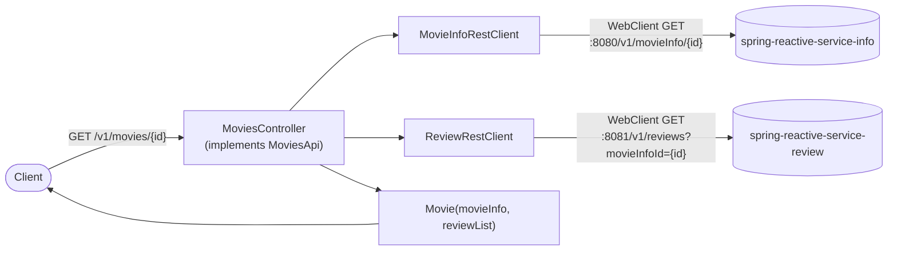
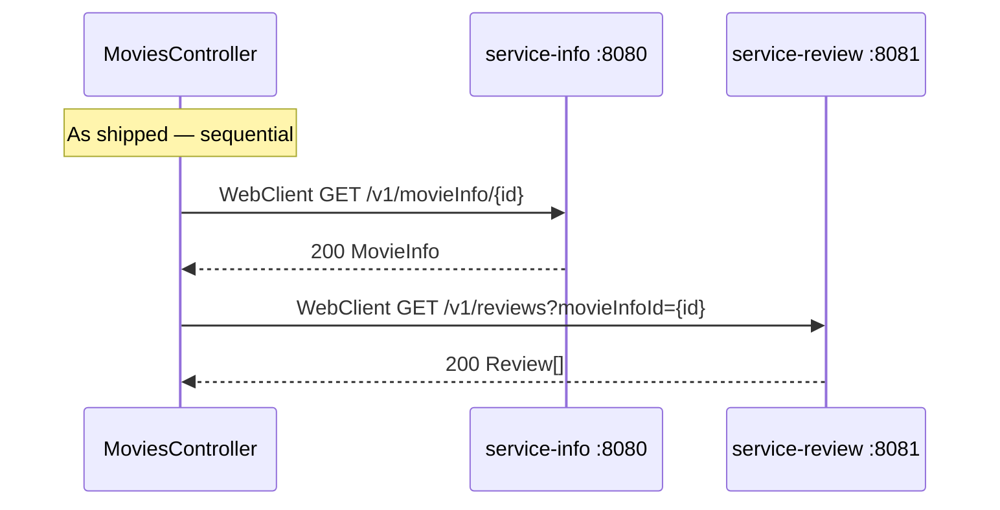
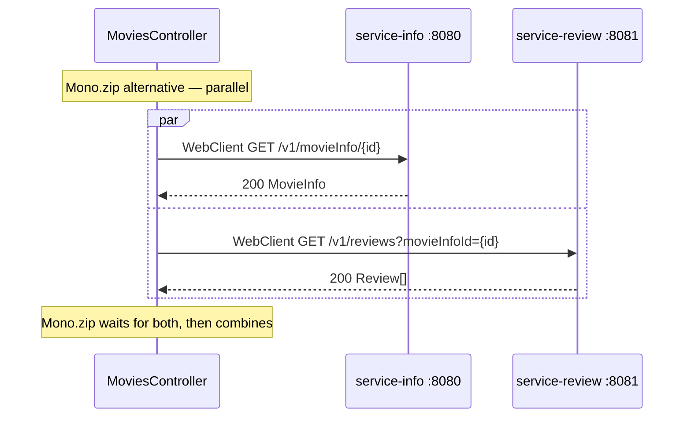

# spring-reactive-service-movies

A pure **aggregation** service — it owns no database. Its only job is to make two non-blocking HTTP calls to two other services (`spring-reactive-service-info` and `spring-reactive-service-review`) and combine their responses into a single `Movie` object. It exists in this repo specifically to demonstrate **WebClient**-based reactive fan-out: how to compose two independent, non-blocking network calls without ever parking a thread while waiting for either one.

```
Port:              8082
MovieInfo service: http://localhost:8080  (spring-reactive-service-info)
Reviews service:   http://localhost:8081  (spring-reactive-service-review)
```

This document assumes you've read the root [`README.md`](../README.md) for the general reactive-programming background (Reactive Streams, `Mono`/`Flux`, backpressure, why non-blocking I/O matters). What follows is specific to what this module does and how its code is organized.

---

## Table of Contents

1. [Why This Module Has No Database](#1-why-this-module-has-no-database)
2. [Architecture](#2-architecture)
3. [The Aggregation Pipeline](#3-the-aggregation-pipeline)
4. [Sequential vs. Parallel Fan-Out](#4-sequential-vs-parallel-fan-out)
5. [WebClient Error Handling and Typed Exceptions](#5-webclient-error-handling-and-typed-exceptions)
6. [Retry with Exponential Backoff](#6-retry-with-exponential-backoff)
7. [The SSE Proxy Endpoint](#7-the-sse-proxy-endpoint)
8. [A Real Gotcha: `release_date` vs `releaseDate`](#8-a-real-gotcha-release_date-vs-releasedate)
9. [Endpoints](#9-endpoints)
10. [Testing with WireMock](#10-testing-with-wiremock)
11. [Observability](#11-observability)
12. [Running This Module](#12-running-this-module)

---

## 1. Why This Module Has No Database

Every other Spring service in this repo (info, review, r2dbc) owns a datastore. This one deliberately does not — it is a **composition layer**. In a real system this pattern shows up as a BFF (Backend-For-Frontend) or an aggregation microservice: it doesn't duplicate data, it fetches from the services that own it and assembles a response shaped for a specific client need (here: "give me a movie with all of its reviews in one call"). Because it holds no state of its own, this is also the simplest module in the repo to reason about — everything it does is either an inbound HTTP request or an outbound `WebClient` call.

## 2. Architecture



**Code organization:**

| Piece | Class | Responsibility |
|---|---|---|
| HTTP contract | `api/MoviesApi` | `@RequestMapping`-annotated interface — the only place HTTP annotations live |
| Controller | `controller/MoviesController` | Implements `MoviesApi`, holds zero annotations of its own, orchestrates the two clients |
| Outbound clients | `client/MovieInfoRestClient`, `client/ReviewRestClient` | One `WebClient`-based class per downstream dependency, each owning its own error mapping and retry policy |
| Domain records | `entity/MovieInfo`, `entity/Review`, `entity/Movie` | Immutable Java records — `Movie` is the composed response, `MovieInfo`/`Review` mirror the upstream services' shapes |
| Error mapping | `exception/*`, `handler/GlobalExceptionHandler` | Typed exceptions per failure mode, mapped to HTTP statuses by a `@RestControllerAdvice` |
| WebClient bean | `config/WebClientConfig` | A single unconfigured `WebClient.builder().build()` shared by both clients |

This mirrors the **interface-first API** pattern used by the info service ([root README §6, Module 2](../README.md#module-2-spring-reactive-service-info)): `MoviesApi` owns the `@RequestMapping`/`@GetMapping` annotations and return types (`Mono<ResponseEntity<Movie>>`, `Flux<MovieInfo>`), and `MoviesController` is a plain implementation class. This keeps the controller trivially unit-testable — you can construct it with mock clients and call its methods directly with no web context needed.

## 3. The Aggregation Pipeline

`MoviesController.retrieveMovieById` is the whole service in one method:

```java
@Override
public Mono<ResponseEntity<Movie>> retrieveMovieById(String movieId) {
    return movieInfoRestClient.retrieveMovieInfo(movieId)
            // Fan-out: fetch reviews once movie info arrives
            .flatMap(movieInfo ->
                    reviewRestClient.retrieveReviews(movieId)
                            .collectList()
                            .map(reviews -> ResponseEntity.ok(new Movie(movieInfo, reviews)))
            )
            .switchIfEmpty(Mono.just(ResponseEntity.<Movie>notFound()
                    .header("X-Reason", "No movie info found for id: " + movieId)
                    .build()));
}
```

Three operators do all the work:

- **`flatMap`** subscribes to the `Mono<MovieInfo>` from `movieInfoRestClient`, and once it emits, uses that value to build the *next* publisher (`reviewRestClient.retrieveReviews(...)`) — the classic "do something async, then do something else async with the result" composition. No blocking `.get()`/`.join()` anywhere; the whole chain is a description of work that only executes on subscription (which Spring WebFlux does automatically when the controller method returns).
- **`collectList()`** turns the `Flux<Review>` into a `Mono<List<Review>>` so it can be combined into a single `Movie` record — a `Movie` holds a materialized list of reviews, not a lazy stream.
- **`switchIfEmpty`** provides the 404 branch: if `retrieveMovieInfo` completes without emitting (movie not found upstream — see [§5](#5-webclient-error-handling-and-typed-exceptions) for how a 404 from the info service becomes an *empty* `Mono` rather than an error here), the fallback publisher runs instead, returning a `404` with an `X-Reason` header explaining why.

## 4. Sequential vs. Parallel Fan-Out

The pipeline above is **sequential fan-out**: `reviewRestClient.retrieveReviews(...)` is only invoked *after* `movieInfoRestClient.retrieveMovieInfo(...)` completes, because it lives inside the `flatMap`'s lambda. The two HTTP calls do not overlap in time.



Since neither call depends on the other's *result* (only `Movie`'s construction needs both), a **parallel** version is possible and is a natural next step for this pipeline:

```java
// Parallel alternative — both HTTP calls fire at the same time
Mono.zip(
    movieInfoRestClient.retrieveMovieInfo(movieId),
    reviewRestClient.retrieveReviews(movieId).collectList()
).map(tuple -> new Movie(tuple.getT1(), tuple.getT2()));
```



`Mono.zip` subscribes to both source publishers immediately and only emits once *both* have completed, pairing their results into a `Tuple2`. The trade-off: `zip` propagates the *first* error from either source immediately (cancelling the other in-flight call), whereas the sequential version never even attempts the reviews call if movie info fails — a reasonable choice either way depending on whether you'd rather fail fast or fail minimally.

## 5. WebClient Error Handling and Typed Exceptions

Both `MovieInfoRestClient` and `ReviewRestClient` use `.onStatus(...)` to intercept HTTP error responses *before* the body is deserialized, mapping them to typed, module-specific exceptions:

```java
webClient.get()
    .uri(movieInfoUrl + "/{movieInfoId}", movieId)
    .retrieve()
    .onStatus(HttpStatusCode::is4xxClientError, response -> {
        if (response.statusCode().equals(HttpStatus.NOT_FOUND)) {
            return Mono.error(new MoviesInfoClientException(
                    "No movie info found for id: " + movieId, response.statusCode().value()));
        }
        return response.bodyToMono(String.class)
                .flatMap(msg -> Mono.error(new MoviesInfoClientException(msg, response.statusCode().value())));
    })
    .onStatus(HttpStatusCode::is5xxServerError, response ->
            response.bodyToMono(String.class)
                    .flatMap(msg -> Mono.error(new MoviesInfoServerException("Server error in MovieInfoService: " + msg))))
    .bodyToMono(MovieInfo.class)
```

Four exception types, one per client × failure class:

| Exception | Thrown when | Retried? | Mapped HTTP status (`GlobalExceptionHandler`) |
|---|---|---|---|
| `MoviesInfoClientException` | Info service returns 4xx | No | The upstream's own status code (carried on the exception) |
| `MoviesInfoServerException` | Info service returns 5xx | Yes | `500 Internal Server Error` |
| `ReviewsClientException` | Review service returns 4xx (except 404, see below) | No | `400 Bad Request` |
| `ReviewsServerException` | Review service returns 5xx | No (no retry configured on this client) | `500 Internal Server Error` |

**Asymmetry worth noting:** `ReviewRestClient` treats a `404` from the review service as `Mono.empty()` rather than an error —

```java
.onStatus(HttpStatusCode::is4xxClientError, response -> {
    if (response.statusCode().equals(HttpStatus.NOT_FOUND)) {
        return Mono.empty();
    }
    ...
})
```

— which reflects a real domain decision: "this movie has no reviews yet" is not a failure, whereas "this movie doesn't exist" (from the info service) is. The same HTTP status code (`404`) is handled two different ways by two different clients in the same request, purely because what it *means* differs per upstream service.

## 6. Retry with Exponential Backoff

Only `MovieInfoRestClient.retrieveMovieInfo` retries, and only on `MoviesInfoServerException` (5xx):

```java
.retryWhen(Retry.backoff(3, Duration.ofSeconds(1))
        .filter(ex -> ex instanceof MoviesInfoServerException)
        .onRetryExhaustedThrow((spec, signal) -> signal.failure()))
```

```
Call 1 fails (5xx) → wait ~1s → Call 2 fails → wait ~2s → Call 3 fails → wait ~4s → Call 4 fails → propagate original exception
```

`Retry.backoff(3, Duration.ofSeconds(1))` retries up to 3 times with exponentially increasing delay starting at 1 second. The `.filter(...)` ensures only server errors trigger a retry — a `MoviesInfoClientException` (4xx, meaning the request itself was bad) is never retried, because resending the same bad request will never succeed. `.onRetryExhaustedThrow` ensures that once retries are exhausted, the caller sees the *original* exception rather than Reactor's generic `Exceptions.RetryExhaustedException` wrapper — useful because `GlobalExceptionHandler` pattern-matches on the specific exception types, not a generic wrapper.

`ReviewRestClient` has no `retryWhen` at all — a design choice consistent with the "missing reviews are not fatal" philosophy from [§5](#5-webclient-error-handling-and-typed-exceptions): retrying an optional, best-effort call adds latency without a correspondingly strong justification.

## 7. The SSE Proxy Endpoint

`GET /v1/movies/stream` re-publishes the info service's live movie-info stream, proxied through this module:

```java
// MoviesApi
@GetMapping(value = "/stream", produces = MediaType.APPLICATION_NDJSON_VALUE)
Flux<MovieInfo> getMovieInfoStream();

// MovieInfoRestClient
public Flux<MovieInfo> retrieveMovieInfoStream() {
    return webClient.get()
            .uri(movieInfoUrl + "/stream")
            .retrieve()
            .onStatus(...)
            .bodyToFlux(MovieInfo.class)
            .repeat()   // resubscribe indefinitely if the upstream stream ever completes
            .log();
}
```

Two details worth understanding:

- **Format translation.** The info service's own `/v1/movieInfo/stream` emits real `text/event-stream` SSE frames (`ServerSentEvent<MovieInfoDocument>` — see the root README's [§10](../README.md#10-server-sent-events-and-sinks)). `WebClient.bodyToFlux(MovieInfo.class)` (target type is the plain DTO, not `ServerSentEvent<T>`) decodes just the `data:` payload of each frame into a `MovieInfo`. This module's own endpoint then re-encodes that `Flux<MovieInfo>` as `application/x-ndjson` (newline-delimited JSON) rather than SSE — so a client of *this* module sees a different wire format than a client hitting the info service directly.
- **`.repeat()`** resubscribes to the upstream `WebClient` call if it ever completes, so a transient upstream disconnect doesn't permanently end this module's own stream. There is no backoff on `.repeat()` here, unlike the retry policy on `retrieveMovieInfo` — a rapid disconnect/reconnect loop against a downed info service would resubscribe immediately and repeatedly.

## 8. A Real Gotcha: `release_date` vs `releaseDate`

`MovieInfo` (this module's own view of a movie, populated by deserializing the info service's JSON response) is declared as:

```java
public record MovieInfo(
        String movieInfoId,
        @NotBlank String name,
        @NotNull @Positive Integer year,
        @NotNull List<@NotBlank String> cast,
        @JsonProperty("release_date") LocalDate releaseDate
) {}
```

`@JsonProperty("release_date")` tells Jackson to read/write this field under the JSON key `release_date` (snake_case). But `spring-reactive-service-info`'s own `MovieInfoDocument` has **no** `@JsonProperty` on its `releaseDate` field, so the info service actually serializes it as `releaseDate` (camelCase, Jackson's default). That means a real response from `GET http://localhost:8080/v1/movieInfo/{id}` — `{"releaseDate": "2008-07-18", ...}` — does **not** populate `MovieInfo.releaseDate` when deserialized here: Jackson looks for a `release_date` key, doesn't find one, and leaves the field `null`.

This is a genuine inconsistency between how the two services model the same field, not a documentation error — it is worth knowing if you extend this module and wonder why a movie's release date always comes back `null` in the aggregated `Movie` response. The fix, if you want one, is either to drop `@JsonProperty("release_date")` from this module's `MovieInfo` record (matching the info service's actual camelCase output) or to add a matching `@JsonProperty` to `MovieInfoDocument` — but as shipped, neither side has been changed to match the other.

## 9. Endpoints

| Method | Path | Description | Response |
|---|---|---|---|
| `GET` | `/v1/movies/{id}` | Aggregate movie info + reviews for one movie | `200 OK` `Movie` JSON, or `404` with `X-Reason` header |
| `GET` | `/v1/movies/stream` | NDJSON proxy of the info service's live movie-info stream | `application/x-ndjson` |
| `GET` | `/actuator/health` | Health check | `200 OK` |
| `GET` | `/actuator/prometheus` | Prometheus scrape endpoint | `text/plain` |

`Movie` schema:
```json
{
  "movieInfo": { "movieInfoId": "1", "name": "Batman Begins", "year": 2005, "cast": ["Christian Bale"], "releaseDate": null },
  "reviewList": [ { "reviewId": "r1", "movieInfoId": 1, "comment": "Awesome Movie", "rating": 9.0 } ]
}
```
(`releaseDate` is shown as `null` here deliberately — see [§8](#8-a-real-gotcha-release_date-vs-releasedate).)

### Example — calling the services directly (bypassing the gateway)

```bash
# Prerequisite: start the info service (8080) and review service (8081) first,
# and MongoDB (see root docker-compose.yml)

# POST a movie info — note the info service expects "releaseDate", not "release_date"
curl -i -X POST http://localhost:8080/v1/movieInfo \
  -H "Content-Type: application/json" \
  -d '{"name":"Batman Begins","year":2005,"cast":["Christian Bale"],"releaseDate":"2005-06-15"}'

# POST a review, referencing that movie's id from the response above
curl -i -X POST http://localhost:8081/v1/reviews \
  -H "Content-Type: application/json" \
  -d '{"movieInfoId":1,"comment":"Awesome Movie","rating":9.0}'

# GET the aggregated movie from this module
curl -i http://localhost:8082/v1/movies/1

# NDJSON stream
curl -N -H "Accept: application/x-ndjson" http://localhost:8082/v1/movies/stream
```

Note that going through the gateway (`http://localhost:8765`) instead of these direct ports additionally requires a `Bearer` JWT — see the root README's [§21 Running the Project](../README.md#21-running-the-project) for how to mint one for local testing.

## 10. Testing with WireMock

`MoviesControllerWireMockInt` (in `src/test/java/intg`) verifies the whole aggregation pipeline — including WebClient error handling and retry — without running either real downstream service:

```java
@SpringBootTest(webEnvironment = RANDOM_PORT)
@AutoConfigureWireMock(port = 0)
class MoviesControllerWireMockInt {
    // WireMock stubs the info and review services at ephemeral ports,
    // application-test.yml points movies.url.movieInfo / movies.url.reviews at them
}
```

`@AutoConfigureWireMock(port = 0)` (from `spring-cloud-contract-wiremock`) starts an embedded WireMock server on a random free port and rewires `movies.url.*` to point at it. Tests stub specific response codes and bodies (200, 404, 500) to exercise every branch in `MovieInfoRestClient`/`ReviewRestClient` — including asserting that a 500 response is actually retried three times before failing, by verifying WireMock received four requests total.

```bash
mvn test
```

## 11. Observability

- **Prometheus**: `GET /actuator/prometheus` (Micrometer + `micrometer-registry-prometheus`)
- **Prometheus scrape config**: `src/main/resources/prometheus/prometheus.yml`

```bash
docker run -d -p 9090:9090 \
  -v $(pwd)/src/main/resources/prometheus/prometheus.yml:/etc/prometheus/prometheus.yml \
  prom/prometheus
```

## 12. Running This Module

```bash
# From this directory
mvn clean package
java -jar target/spring-reactive-service-movies-0.0.1-SNAPSHOT.jar

# Or from the root multi-module project
cd .. && mvn clean package -pl spring-reactive-service-movies
```

This module inherits shared dependency management (Spring Cloud BOM, Testcontainers BOM, `jjwt`) from the root `learning-reactive-parent` POM — see the root [`README.md`](../README.md) for the full multi-module build and the whole system's `docker-compose.yml`-based startup sequence.
