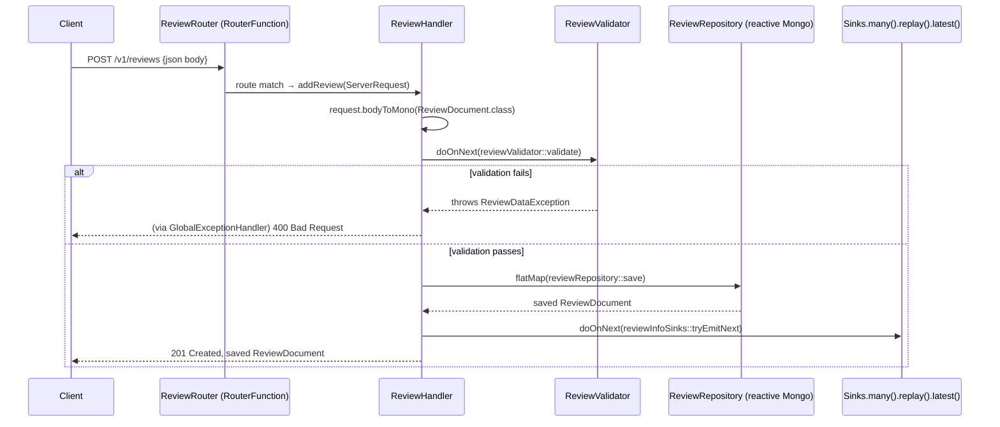

# spring-reactive-service-review

A reactive CRUD service for movie reviews, backed by MongoDB. Architecturally, this is the **deliberate counterpart** to `spring-reactive-service-info`: both are WebFlux + reactive MongoDB services doing similar CRUD + SSE work, but this module is written entirely in Spring WebFlux's **functional** style (`RouterFunction` + `Handler`) instead of the annotation-based `@RestController` style used by the info service. Read both modules side by side to see the same problem solved two different ways.

```
Port:    8081
MongoDB: localhost:27017 (database: local)
```

This document assumes you've read the root [`README.md`](../README.md) for general reactive-programming background. What follows is specific to this module.

---

## Table of Contents

1. [Functional Routing: Router + Handler](#1-functional-routing-router--handler)
2. [Request Flow](#2-request-flow)
3. [Manual Validation Instead of `@Valid`](#3-manual-validation-instead-of-valid)
4. [Global Error Handling: `ErrorWebExceptionHandler`](#4-global-error-handling-errorwebexceptionhandler)
5. [SSE with `Sinks.many().replay().latest()`](#5-sse-with-sinksmanyreplaylatest)
6. [Endpoints](#6-endpoints)
7. [Testing](#7-testing)
8. [Running This Module](#8-running-this-module)

---

## 1. Functional Routing: Router + Handler

Spring WebFlux offers two ways to declare HTTP endpoints. `spring-reactive-service-info` uses the annotation-based style (`@RestController`, `@GetMapping`) — see the root README's [§9](../README.md#9-spring-webflux-deep-dive). This module uses the **functional** style instead: routes are declared as data (a `RouterFunction<ServerResponse>` bean), and request handling logic lives in a separate `Handler` class with no Spring annotations on its methods at all.

```java
// ReviewRouter — pure routing table. No business logic, no annotations on the target methods.
@Configuration
public class ReviewRouter {
    @Bean
    public RouterFunction<ServerResponse> reviewRouterFunction() {
        return route()
                .nest(path("/v1/reviews"), builder -> builder
                        .POST("", reviewHandler::addReview)
                        .GET("", reviewHandler::getReviews)
                        .GET("", queryParam("movieInfoId", i -> true), reviewHandler::getReviews)
                        .GET("/{reviewId}", reviewHandler::getReviews)
                        .GET("/stream", reviewHandler::getReviewsStream)
                        .PUT("/{reviewId}", reviewHandler::upsertReview)
                        .DELETE("/{reviewId}", reviewHandler::deleteReview))
                .GET("/v1/helloworld", req -> ServerResponse.ok().bodyValue("helloworld"))
                .build();
    }
}
```

```java
// ReviewHandler — reads the ServerRequest, returns Mono<ServerResponse>. Pure application logic.
public Mono<ServerResponse> addReview(ServerRequest request) {
    return request.bodyToMono(ReviewDocument.class)
            .doOnNext(reviewValidator::validate)
            .flatMap(reviewRepository::save)
            .doOnNext(reviewInfoSinks::tryEmitNext)
            .flatMap(ServerResponse.status(HttpStatus.CREATED)::bodyValue);
}
```

`.nest(path("/v1/reviews"), ...)` groups every review route under a shared path prefix, so the individual route declarations only specify the suffix (`""`, `"/{reviewId}"`, `"/stream"`). Two routes are registered for plain `GET ""`: one unconditional, and one additionally guarded by `queryParam("movieInfoId", i -> true)` — Spring evaluates route predicates in declaration order, so `GET /v1/reviews?movieInfoId=5` matches the queryParam-guarded route (letting `getReviews` branch on the presence of that parameter), while `GET /v1/reviews` with no query string falls through to the plain route. A `GET /v1/helloworld` route outside the `/v1/reviews` nest shows that a `RouterFunction` can freely mix nested and top-level routes in the same bean.

**Why this style, and when to prefer it over annotations:** functional routing makes the entire route table visible in one place as ordinary Java — no scanning for `@RequestMapping`-annotated classes, no reflection-based route resolution. It is also directly unit-testable: `reviewRouterFunction()` returns a plain `RouterFunction<ServerResponse>` you can invoke against a mock `ServerRequest` without booting any web server. The annotation style (used by the info service) reads more familiarly to anyone coming from Spring MVC and integrates more naturally with tools that inspect `@RequestMapping` metadata (like springdoc/OpenAPI generators).

## 2. Request Flow



Every step in `addReview` is one non-blocking operator in a single chain: deserialize the body, validate (synchronously, but as a pipeline side-effect via `doOnNext`), save to MongoDB, publish to the SSE sink, then serialize the response. No step blocks the Netty event-loop thread — `bodyToMono`, `reviewRepository.save`, and `ServerResponse...bodyValue` are all asynchronous under the hood.

## 3. Manual Validation Instead of `@Valid`

`ServerRequest.bodyToMono(...)` in functional routing does **not** trigger Spring's Bean Validation automatically — there is no controller-method parameter for `@Valid` to attach to. This module works around that with an explicit `ReviewValidator` component that runs Jakarta Bean Validation's `Validator` programmatically:

```java
@Component
public class ReviewValidator {
    private final Validator validator;

    public void validate(ReviewDocument reviewDocument) {
        Set<ConstraintViolation<ReviewDocument>> violations = validator.validate(reviewDocument);
        if (!violations.isEmpty()) {
            var errorMessage = violations.stream()
                    .map(ConstraintViolation::getMessage)
                    .sorted()
                    .collect(joining(","));
            throw new ReviewDataException(errorMessage);
        }
    }
}
```

`ReviewDocument`'s constraints (`@NotNull` on `movieInfoId`, `@Min(0)` on `rating`) are ordinary Jakarta Validation annotations — the same annotation vocabulary as the info service's `@NotBlank`/`@Positive` on `MovieInfoDocument`. What differs is *who* triggers the check: in the annotation-based info service, `@Valid` on the controller parameter makes Spring do it; here, `ReviewHandler.addReview` explicitly calls `reviewValidator.validate(...)` inside a `.doOnNext(...)` step of its own pipeline. `ReviewValidator` throws a plain `RuntimeException` (`ReviewDataException`) rather than emitting a reactive error signal directly — Reactor treats an exception thrown from within an operator's lambda the same as an explicit `Mono.error(...)`, so it still propagates downstream as an error signal, just via a different syntax.

## 4. Global Error Handling: `ErrorWebExceptionHandler`

The info and movies services use `@RestControllerAdvice` + `@ExceptionHandler` for centralized error mapping — an annotation-based mechanism that only applies to annotated controller methods. Functional routing has no controller methods for `@ExceptionHandler` to attach to, so this module instead implements Spring WebFlux's lower-level `ErrorWebExceptionHandler` SPI directly:

```java
@Component
public class GlobalExceptionHandler implements ErrorWebExceptionHandler {
    @Override
    public Mono<Void> handle(ServerWebExchange exchange, Throwable ex) {
        DataBufferFactory factory = exchange.getResponse().bufferFactory();
        var buffer = factory.wrap(ex.getMessage().getBytes());

        if (ex instanceof ReviewDataException) {
            exchange.getResponse().setStatusCode(HttpStatus.BAD_REQUEST);
        } else if (ex instanceof ReviewNotFoundException) {
            exchange.getResponse().setStatusCode(HttpStatus.NOT_FOUND);
        } else {
            exchange.getResponse().setStatusCode(HttpStatus.INTERNAL_SERVER_ERROR);
        }
        return exchange.getResponse().writeWith(Mono.just(buffer));
    }
}
```

`ErrorWebExceptionHandler` sits below the `DispatcherHandler`/routing layer entirely — it intercepts *any* unhandled exception that escapes a `RouterFunction`'s handler chain, regardless of whether the app is written functionally or with annotations. This module writes the response body directly to a `DataBuffer` rather than returning a typed object, because at this layer there is no content-negotiation/`HttpMessageWriter` machinery available the way there is inside a normal handler method — it is working one level closer to the raw `ServerWebExchange`.

| Exception | Meaning | Status |
|---|---|---|
| `ReviewDataException` | Bean Validation failed (thrown by `ReviewValidator`) | `400 Bad Request` |
| `ReviewNotFoundException` | `reviewId` (or `movieInfoId`) not found in MongoDB | `404 Not Found` |
| anything else | Unexpected failure | `500 Internal Server Error` |

## 5. SSE with `Sinks.many().replay().latest()`

```java
private final Sinks.Many<ReviewDocument> reviewInfoSinks = Sinks.many().replay().latest();

public Mono<ServerResponse> getReviewsStream(ServerRequest request) {
    return ServerResponse.ok()
            .contentType(MediaType.APPLICATION_NDJSON)
            .body(reviewInfoSinks.asFlux(), ReviewDocument.class);
}
```

Contrast this with the info service's `Sinks.many().replay().all()` (root README [§10](../README.md#10-server-sent-events-and-sinks)): `replay().latest()` means a *new* SSE subscriber only receives the single most-recently-emitted review, plus everything emitted after it subscribes — not the full history since service startup. This is the right choice for a "what just happened" live feed where an unbounded replay buffer would otherwise grow forever; the info service's `replay().all()`, by contrast, is appropriate when new subscribers genuinely need the full event history (e.g., an audit trail). The output format also differs from the info service: this endpoint emits `application/x-ndjson` (newline-delimited raw JSON objects), not the `text/event-stream` framing (`id`/`event`/`data`) the info service now uses.

## 6. Endpoints

| Method | Path | Description | Body | Response |
|---|---|---|---|---|
| POST | `/v1/reviews` | Create a review | `ReviewDocument` JSON | `201 Created` |
| GET | `/v1/reviews` | List all reviews | — | `200 OK` array |
| GET | `/v1/reviews?movieInfoId=123` | Reviews for one movie | — | `200 OK` filtered array, or `404` if none exist |
| GET | `/v1/reviews/{reviewId}` | Get one review by ID | — | `200 OK` or `404` |
| PUT | `/v1/reviews/{reviewId}` | Update comment and rating | `ReviewDocument` JSON | `200 OK` or `404` |
| DELETE | `/v1/reviews/{reviewId}` | Delete a review | — | `204 No Content` |
| GET | `/v1/reviews/stream` | SSE — most recent review + live updates | — | `application/x-ndjson` |
| GET | `/v1/helloworld` | Smoke-test route, outside the `/v1/reviews` nest | — | `200 OK` `"helloworld"` |

`ReviewDocument` schema:
```json
{
  "reviewId": "r1",
  "movieInfoId": 123,
  "comment": "Excellent film",
  "rating": 9.5
}
```
`rating` must be `>= 0`; `movieInfoId` must be present. `reviewId` is server-generated (MongoDB `@Id`) — omit it on `POST`.

### Example

```bash
# Prerequisite: MongoDB running (see root docker-compose.yml)

curl -i -X POST http://localhost:8081/v1/reviews \
  -H "Content-Type: application/json" \
  -d '{"movieInfoId":1,"comment":"Awesome Movie","rating":9.0}'

curl -s "http://localhost:8081/v1/reviews?movieInfoId=1"

curl -N -H "Accept: application/x-ndjson" http://localhost:8081/v1/reviews/stream
```

Calling this service through the gateway (`http://localhost:8765/v1/reviews/**`) instead of its own port additionally requires a `Bearer` JWT — see the root README's [§21 Running the Project](../README.md#21-running-the-project).

## 7. Testing

```bash
mvn test
```

- **`unit/ReviewTest`** — plain unit test, no Spring context.
- **`intg/.../repository/ReviewRepositoryInt`** — repository-level integration test.
- **`intg/.../router/ReviewInt`** — full `@SpringBootTest` + Testcontainers integration test:
  ```java
  @SpringBootTest
  @Testcontainers
  @AutoConfigureWebTestClient
  class ReviewInt {
      @Container
      @ServiceConnection
      static MongoDBContainer mongo = new MongoDBContainer("mongo:7");
      ...
  }
  ```
  `@ServiceConnection` auto-configures `spring.data.mongodb.uri` to point at the Testcontainers-managed MongoDB instance — no hardcoded port in `application-test.yml`. This exercises the real `RouterFunction` → `ReviewHandler` → `ReviewRepository` chain end to end via `WebTestClient`, against a real (containerized) MongoDB.

## 8. Running This Module

```bash
# From this directory
mvn clean package
java -jar target/spring-reactive-service-review-0.0.1-SNAPSHOT.jar

# Or from the root multi-module project
cd .. && mvn clean package -pl spring-reactive-service-review
```

This module inherits shared dependency management from the root `learning-reactive-parent` POM. See the root [`README.md`](../README.md) for the full multi-module build, the whole system's `docker-compose.yml`-based infrastructure startup, and how this service fits into the gateway-fronted architecture.
